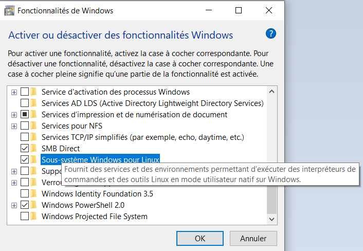
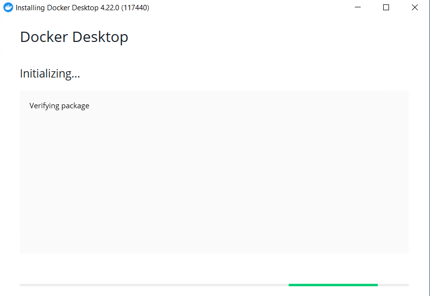
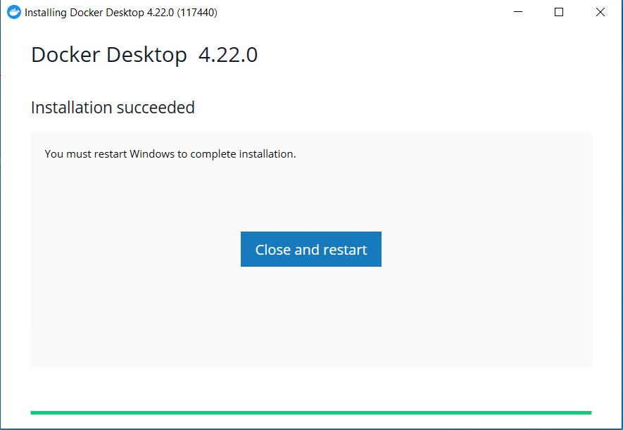
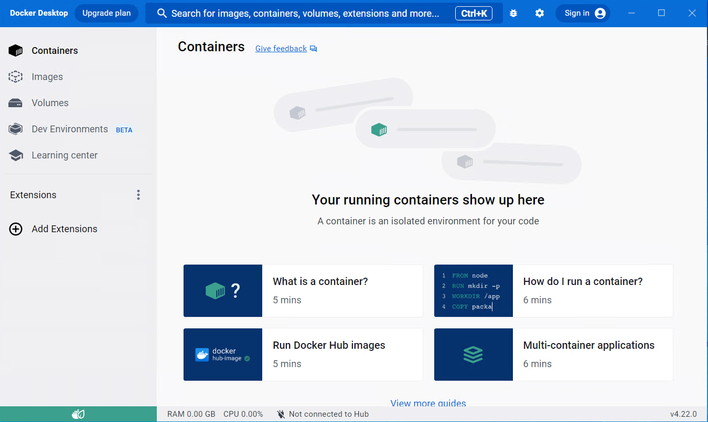

# Introduction

Docker is an open-source platform that simplifies the deployment and management of applications in containers. Containers are isolated, portable environments that allow developers to package an application and its dependencies for consistent execution on different systems. This guide will help you install Docker on a Windows 10 PC, providing detailed steps for a successful installation.

# Step 1: Check the prerequisites

Before installing Docker, make sure your system meets the minimum requirements.
There are two ways to install Docker on Windows:

- Via WSL
- Via Hyper-V

Requirements depend on how you choose to install Docker. 
Please note that only installation via WSL is compatible with Windows 10/11 Home, Pro, Enterprise or Education editions.

## Requirements for docker installation via WSL

* WSL version 1.1.3.0 or higher.
* Windows 10 64-bit: Home or Pro 21H2 (build >= 19044), or Enterprise or Education 21H2 (build >= 19044).
* Windows 11 64-bit: Home or Pro version 21H2 or higher, or Enterprise Education version 21H2 or higher.
* Enable WSL 2 functionality on Windows.

## Requirements for docker installation via Hyper-V

Windows 10 64-bit: Pro 21H2 (build >= 19044) or Enterprise or Education 21H2 (build >= 19044).
Windows 11 64-bit: Pro 21H2 (build >= 19044) or Enterprise or Education 21H2 (build >= 19044).


You'll need to enable Hyper-V functionality on your computer. 

The prerequisites for installing Docker via Hyper-V are given here as a guide. In this article, we'll be installing Docker via WSL2. Please note that installing Docker via Hyper-V gives you the option of using Windows containers.

# Installing Docker 

Docker is a tool that can package an application and its dependencies in an isolated container, which can be run on any server. It runs on Linux and extends the standard Linux container format, LXC, with a high-level API providing a practical virtualization solution that runs processes in isolation. 


The problem is that we want to install Docker on Windows, the Linux kernel is different from Docker and is not compatible. So we need a way to run a Linux operating system on Windows: that's what WSL can do. 
Windows Subsystem for Linux (WSL) is a compatibility layer that lets you run Linux binary executables natively on Windows 10, Windows 11 and Windows Server 2019. WSL 2 was released in May 2019. 

## Activate WSL 2

You must first activate WSL2 on your computer. Make sure that virtualization is enabled in the BIOS.


Windows will then ask you to restart your PC in order to update the settings. Save your work in progress, then restart your PC. 



Alternatively, you can activate this feature using Powershell.
If you're using a build of Windows 10 >= 2004 or you have Windows 11, then the following command will enable you to install everything WSL needs to run.

```pwsh
wsl --install
```

## Download Docker Desktop

Docker Desktop is the fastest way to install Docker on Windows. It contains all the dependencies needed to install Docker. In addition to Docker, it provides you with a graphical interface for managing your images and containers. 
Docker Desktop is proprietary software. It requires a paid subscription per user for organizations with more than 250 employees or more than $10 million in annual revenues. If you plan to use Docker Desktop for personal use you don't have to pay for a license. 

* Go to the official Docker website to download the Docker Desktop installer: https://docs.docker.com/desktop/install/windows-install/

* Once the download is complete, run the installer. You must have administrator privileges on your PC. Please note that Docker is installed for all PC users.


* The installer starts



* You'll see a summary of what the installer will do. Be sure to check the *Use WSL 2 instead of Hyper-V* box to install Docker using WSL 2.


* Installation begins, Docker Desktop extracts the files required for installation. 


* Please allow 3-5 minutes, depending on the speed of your PC. 

If you see this screen, the installation has been successful. You can close the installer and restart your computer by clicking on the *Close and restart* button.



* You can launch Docker Desktop via the shortcut added to your desktop (if you didn't uncheck this option during installation), or search for Docker by pressing the Windows key and then "Docker". 
The program will open, waiting for the Docker engine to load. 

Docker Desktop will ask you to accept the software's terms of use. Then a page will open asking you to log in to your Docker account, which is the same account as Docker Hub. But you don't have to log in, just click on *Continue without signing in* to access Docker without logging in.


## Docker Desktop interface

Here's how the Docker Desktop interface looks once you've completed the installation.




# Conclusion

In this article, you've learned how to install Docker on a Windows 10/11 PC via Docker Desktop.

# Sources
Install Docker desktop on Windows. (2023, August 8). Docker Documentation. https://docs.docker.com/desktop/install/windows-install/