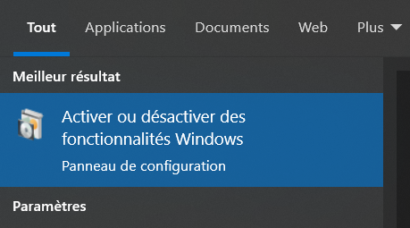
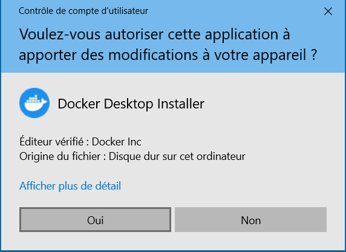
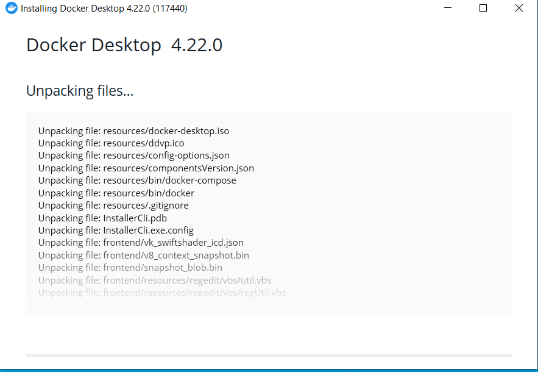
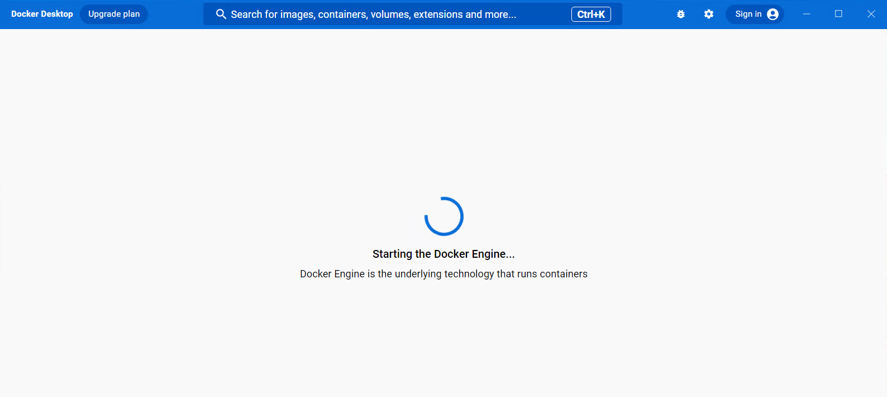

# Introduction

Docker est une plateforme open-source qui simplifie le déploiement et la gestion d'applications dans des conteneurs. Les conteneurs sont des environnements isolés et portables qui permettent aux développeurs d'emballer une application et ses dépendances pour une exécution cohérente sur différents systèmes. Ce guide vous aidera à installer Docker sur un PC sous Windows 10, en vous fournissant des étapes détaillées pour une installation réussie.

# Étape 1 : Vérification des Prérequis

Avant d'installer Docker, assurez-vous que votre système répond aux exigences minimales.
Il existe deux façons d'installer Docker sur Windows :

- Via WSL
- Via Hyper-V

Les exigences dépendent de la façon dont vous choisissez d'installer Docker. 
Sachez que seule l'installation via WSL est compatible avec les éditions de Windows 10/11 Home, Pro, Enterprise ou Education.

## Préréquis pour l'installation de Docker via WSL

* WSL version 1.1.3.0 ou supérieure.
* Windows 10 64-bit: Home ou Pro 21H2 (build >= 19044), ou Enterprise ou Education 21H2 (build >= 19044).
* Windows 11 64-bit: Home ou Pro version 21H2 supérieure, ou Enterprise Education version 21H2 or higher.
* Activer la fonctionnalité WSL 2 sur Windows.

## Préréquis pour l'installation de Docker via Hyper-V

Windows 10 64-bit: Pro 21H2 (build >= 19044) ou Enterprise ou Education 21H2 (build >= 19044).
Windows 11 64-bit: Pro 21H2 (build >= 19044) ou Enterprise ou Education 21H2 (build >= 19044).
Vous devrez activer la fonctionnalité Hyper-V sur votre ordinateur. 

Les préréquis de l'installation de Docker via Hyper-V sont donnés ici à titre indicatif, dans cet article nous allons installer Docker via WSL2. Sachez que installer Docker via Hyper-V vous donne la possibilité d'utiliser les conteneurs Windows.

# Installer Docker 

Docker est un outil qui peut empaqueter une application et ses dépendances dans un conteneur isolé, qui pourra être exécuté sur n'importe quel serveur. Il fonctionne sur Linux et étend le format de conteneur Linux standard, LXC, avec une API de haut niveau fournissant une solution pratique de virtualisation qui exécute les processus de façon isolée. 


Le problème c'est que nous voulons installer Docker sur Windows, le noyau Linux est différent de Docker et n'est pas compatible. Il faudrait donc un moyen pour lancer un système d'exploitation Linux sur Windows : c'est ce que permet de faire WSL. 
Windows Subsystem for Linux (WSL) est une couche de compatibilité permettant d'exécuter des exécutables binaires Linux de manière native sur Windows 10, Windows 11 et Windows Server 2019. La version WSL 2 est sortie en mai 2019. 

## Activer WSL 2

Vous devez dans un premier temps activer WSL2 sur votre ordinateur. Assurez-vous que la virtualisation est autorisée au niveau du BIOS. 



Windows vous demande ensuite de rédemarrer votre PC afin de mettre à jour les paramètres. Enregistrer vos travaux en cours puis redémarrez votre PC. 


Alternativement, vous pouvez activier cette fonctionnalité à l'aide de Powershell.
Si vous utilisez un build de Windows 10 >= 2004 ou vous avez Windows 11 alors la commande suivante vous permettra d'installer tout ce dont WSL a besoin pour fonctionner.

```pwsh
wsl --install
```

## Télécharger Docker Desktop

Docker Desktop est la solution la plus rapide pour installer Docker sur Windows. Il contient toutes les dépendances pour installer Docker. En plus de Docker, il vous fournit une interface graphique pour gérer vos images et conteneurs. 
Docker Desktop est un logiciel propriétaire. Il nécessite un abonnement payant par utilisateur pour les organisations de plus de 250 employés ou de plus de 10 millions de dollars de revenus annuels. Si vous prévoyez d'utiliser Docker Desktop pour un usage personnel vous n'avez pas à payer pour une licence. 

* Rendez-vous sur le site officiel de Docker pour télécharger le programme d'installation de Docker Desktop : https://docs.docker.com/desktop/install/windows-install/

* Une fois le téléchargement terminé, lancer le programme d'installation. Vous devez avoir les privilèges d'administrateur sur le PC. Sachez que Docker est installé pour tous les utilisateurs du PC.



* Le programme d'installation se lance


* Vous avez un récapitulatif de ce que le programme d'installation va faire. Assurez-vous bien de cocher la case *Use WSL 2 instead of Hyper-V* pour que le Docker soit installé à l'aide de WSL 2.


* L'installation commence, Docker Desktop extraie les fichiers nécessaires à l'installer. 



* Compter environ 3 à 5 minutes en fonction de la rapidité de votre PC. 

Si vous voyez cet écran, cela signifie que l'installation est un succès. Vous pouvez fermer le programme d'installation puis rédémarrer votre ordinateur en cliquant sur le bouton *Close and restart*.


* Vous pouvez lancer Docker Desktop via le raccourci ajouté sur votre bureau (si vous n'avez décoché cette option au moment de l'installation) ou recherchez Docker dans en cliquant sur la touche Windows puis "Docker". 
Le programme s'ouvre, attendez le temps que le moteur Docker se charge. 

Docker Desktop vous demandera d'accepter les termes d'utilisation du logiciel. Ensuite une page s'ouvre vous demandant de vous connecter à votre compte Docker, c'est le même compte que Docker Hub. Mais vous n'êtes pas obligés de vous connecter, cliquer sur *Continue without signing in* pour accéder à Docker sans vous connecter.




## Interface de Docker Desktop

Voici comment se présente l'interface de Docker Desktop une fois que vous avez terminé l'installation.


# Conclusion

Dans cet article, vous avez appris comment installer Docker sur un PC Windows 10/11 via Docker Desktop.

# Sources
Install Docker desktop on Windows. (2023, août 8). Docker Documentation. https://docs.docker.com/desktop/install/windows-install/