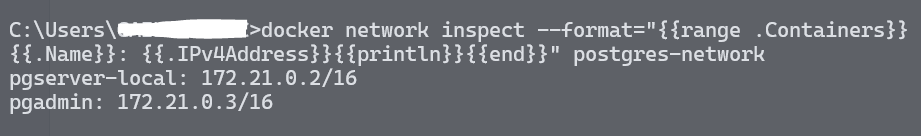
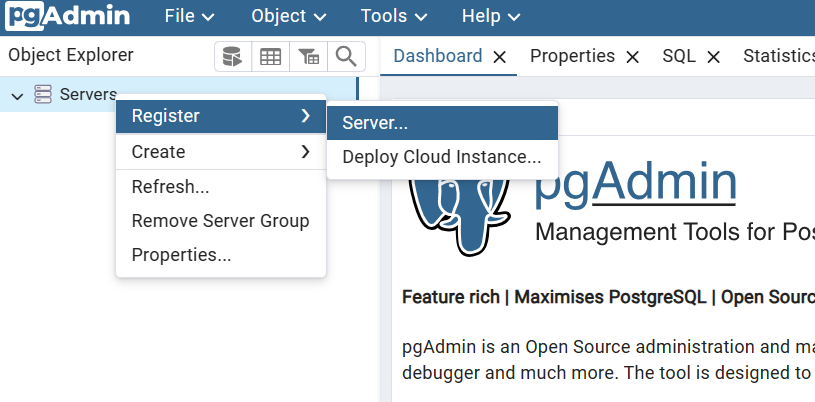
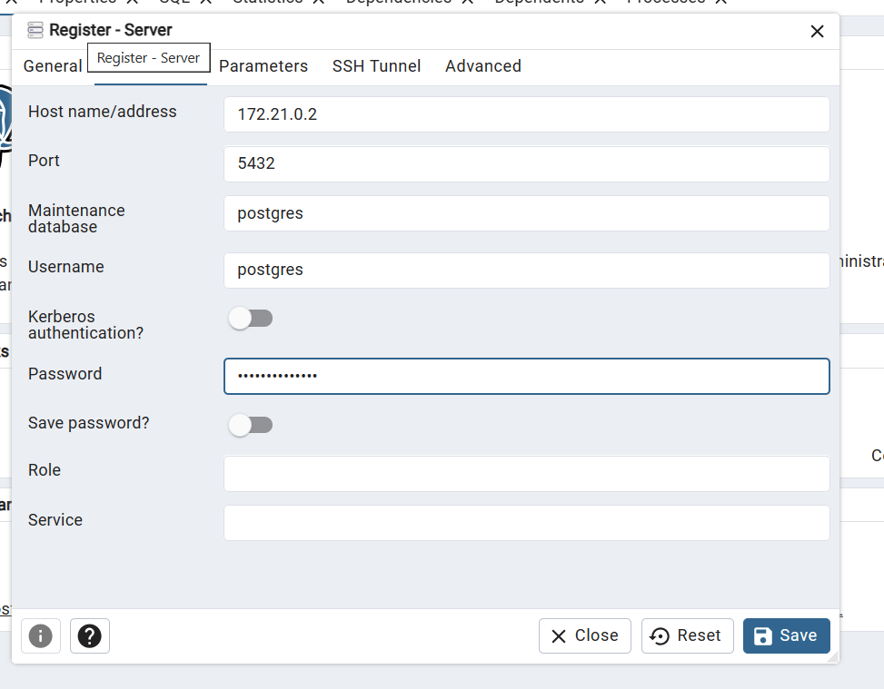

Dans cet article, je vais présenter brièvement le proecess d'installation de PostgreSQL et PgAdmin en utilisant Docker. Le but en utilisant est Docker dans c'est de vous permettre de reproduire l'environnement si vous le souhaitez.

### Pourquoi choisir PostgreSQL et PgAdmin ?

**PostgreSQL** :

PostgreSQL est une base de données relationnelle open source extrêmement robuste, offrant de nombreuses fonctionnalités avancées telles que la prise en charge de JSON, de la géolocalisation, des requêtes complexes et bien plus encore. Connu pour sa fiabilité, sa conformité aux normes ANSI SQL et sa capacité à gérer de grands volumes de données, PostgreSQL est utilisé par de nombreuses entreprises et organisations dans le monde entier pour leurs applications critiques.

**PgAdmin** :

PgAdmin est une interface d'administration web open source pour PostgreSQL, offrant une manière conviviale de créer, gérer et surveiller vos bases de données PostgreSQL. Avec PgAdmin, les utilisateurs peuvent exécuter des requêtes SQL, importer et exporter des données, créer des sauvegardes et bien plus encore, le tout via une interface graphique intuitive.

### Installation de PostgreSQL et PgAdmin via Docker :

Pour simplifier le processus d'installation et d'exécution de PostgreSQL et PgAdmin, nous utiliserons Docker. Assurez-vous d'avoir Docker installé sur votre système avant de continuer. Si ce n'est pas le cas, vous pouvez le télécharger et l'installer à partir du [site officiel de Docker](https://www.docker.com/get-started).

Voici les étapes pour installer PostgreSQL et PgAdmin via Docker :

**1. Téléchargez l'image PostgreSQL depuis Docker Hub :**

Il est toujours recommandé, lorsqu'on tire une image à partir de Docker Hub, de préciser la version. Nous allons tirer la dernière version qui est la 16.2 au moment de la rédaction de cet article.

```
docker pull postgres:16.2
```

Cette commande téléchargera l'image PostgreSQL officielle depuis Docker Hub sur votre système.

**2. Créez un conteneur PostgreSQL :**

Nous créons un conteneur du serveur Postgres en liant le port 5432 du conteneur au port 5432 de notre machine. 
Le fait d'exposer le lier le port 5432 à notre machine nous permettra fournir ce port dans la chaine de connexion à Postgres à partir d'une application C#. 

```
docker run --name pgserver-local -p 5432:5432 -e POSTGRES_PASSWORD=$ecureP@ssword -d postgres:16.2
```

Remplacez `$ecureP@ssword` par le mot de passe de votre choix. Cette commande créera un conteneur PostgreSQL nommé `pgserver-local` en utilisant l'image que nous avons téléchargée précédemment.

**3. Téléchargez l'image PgAdmin depuis Docker Hub :**

```
docker pull dpage/pgadmin4:8.4
```

Cette commande téléchargera l'image PgAdmin depuis Docker Hub sur votre système.

**4. Créez un conteneur PgAdmin :**

Nous créons un conteneur pour pgAdmin que nous lions le port 80 du conteneur à notre machine via le port 5050.

```
docker run --name pgadmin -p 5050:80 -e PGADMIN_DEFAULT_EMAIL=user@dev.net -e PGADMIN_DEFAULT_PASSWORD=mysecretpassword -d dpage/pgadmin4:8.4
```

Remplacez `user@dev.net` par votre adresse e-mail et `mysecretpassword` par le mot de passe de votre choix. Cette commande créera un conteneur PgAdmin nommé `pgadmin` et le liera au port 5050 sur votre machine hôte.

Après avoir suivi ces étapes, vous devriez avoir PostgreSQL et PgAdmin en cours d'exécution sur votre machine via Docker. Vous pouvez accéder à PgAdmin en ouvrant un navigateur web et en naviguant vers `http://localhost:5050`. Connectez-vous en utilisant l'adresse e-mail et le mot de passe que vous avez spécifiés lors de la création du conteneur.

### Créer un réseau Docker pour faciliter la découverte de Postgres et PgAdmin

Nous allons créer un réseau Docker `postgres-network` pour permettre que le serveur Postgres et PgAdmin se découvrent facilement. Cela aide aussi à cacher ces deux conteneurs des autres conteneurs qui ne font pas partie du réseau. 

```
docker network create -d bridge postgres-network
```
Nous pouvons ajouter le serveur Postgres et PgAdmin au réseau.

```
docker network connect postgres-network pgserver-local
docker network connect postgres-network pgadmin
```

Nous pouvons inspecter les adresses IP des deux conteneurs dans le réseau postgres-network.

```
docker network inspect --format="{{range .Containers}}{{.Name}}: {{.IPv4Address}}{{println}}{{end}}" postgres-network
```


### Accéder au serveur Postgres via PgAdmin

Une fois les étapes précédentes réalisées nous accédons à PgAdmin via http://localhost:5050/. Via la page nous pouvons saisir les identifiants que nous avons définis à la création du conteneur PgAdmin. 


Après avoir saisi les identifiants PgAdmin nous pouvons enregistrer le serveur Postgres que nous avons créé grâce aux identifiants. 




Une fois le serveur Postgres enregistré nous pouvons consulter tous les bases de données existantes et autres objets. Par défaut, une base de données de maintenance nommée `postgres` est créée sur le serveur. 

### Conclusion :

En utilisant Docker pour installer PostgreSQL et PgAdmin, les développeurs peuvent rapidement mettre en place un environnement de développement local pour la gestion de bases de données. PostgreSQL offre une solution robuste pour stocker et manipuler des données, tandis que PgAdmin simplifie l'administration et la surveillance des bases de données via une interface conviviale. En combinant ces outils avec Docker, les développeurs peuvent efficacement gérer leurs bases de données et se concentrer sur le développement de leurs applications.