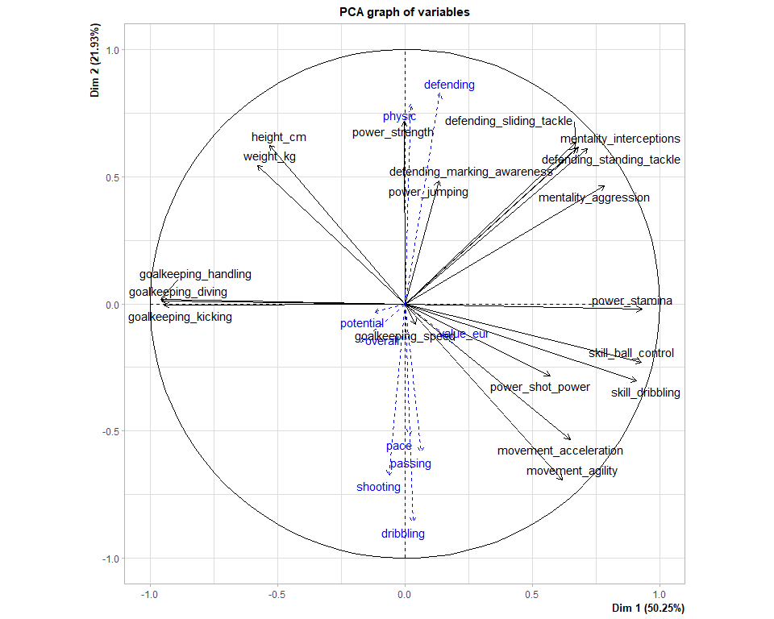
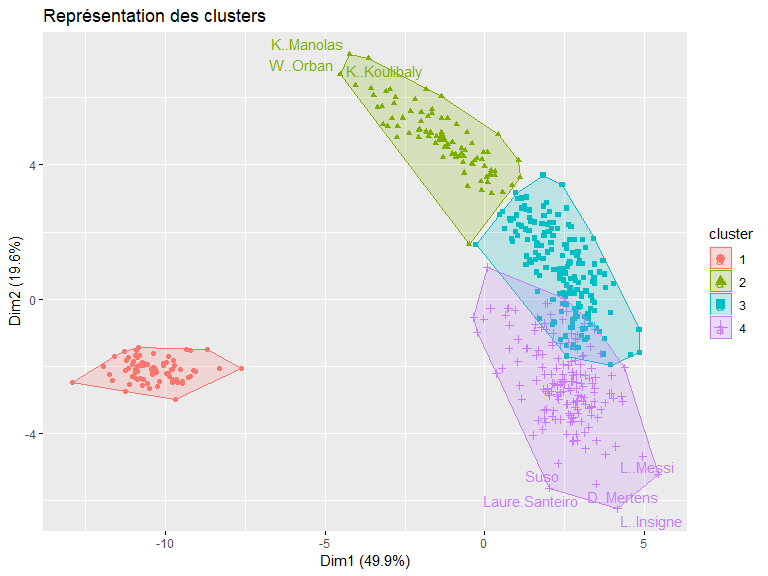
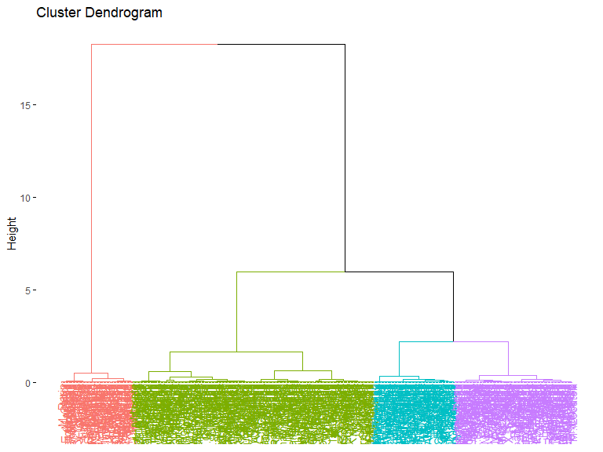
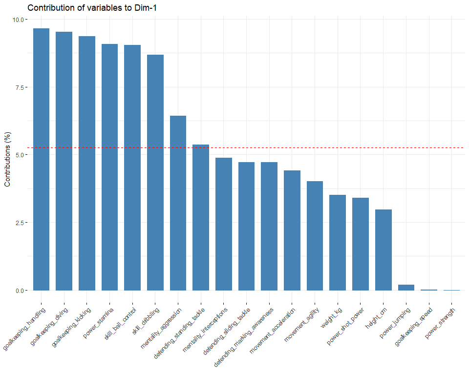
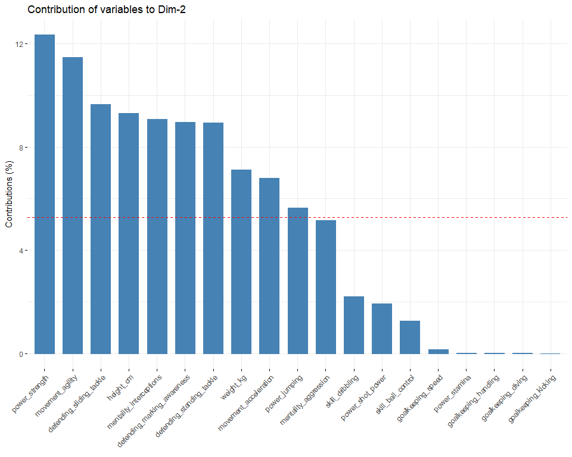
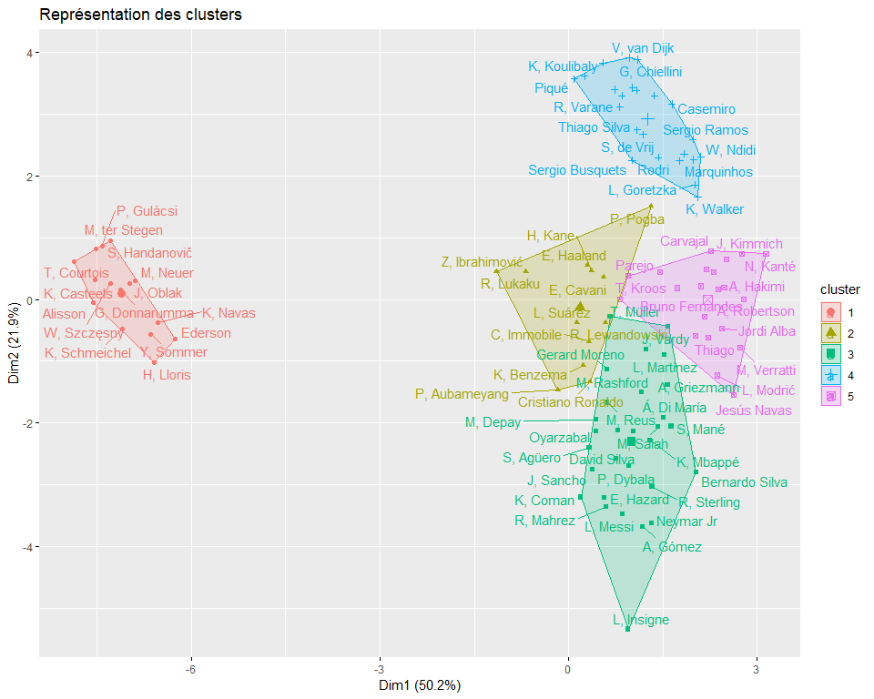
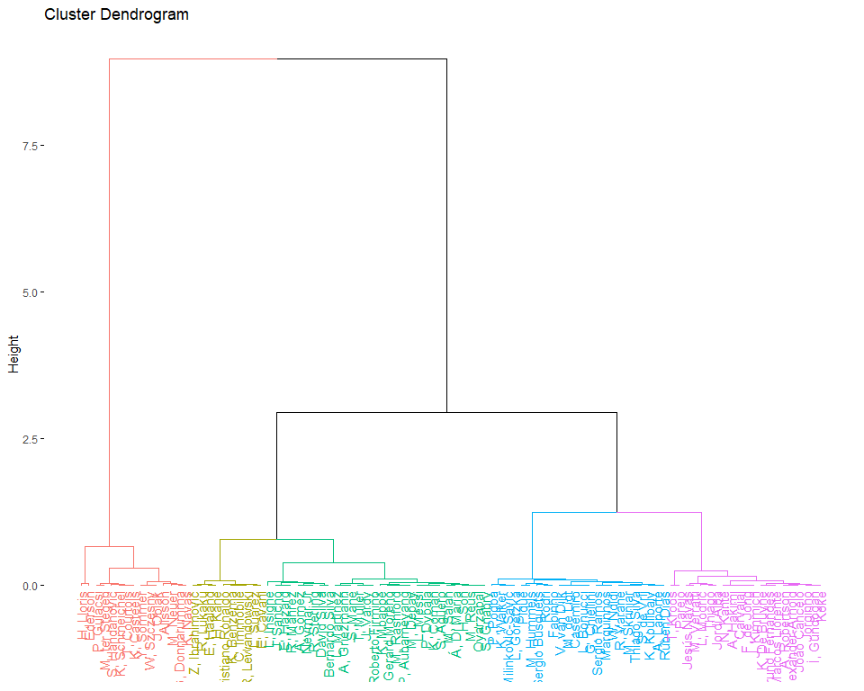
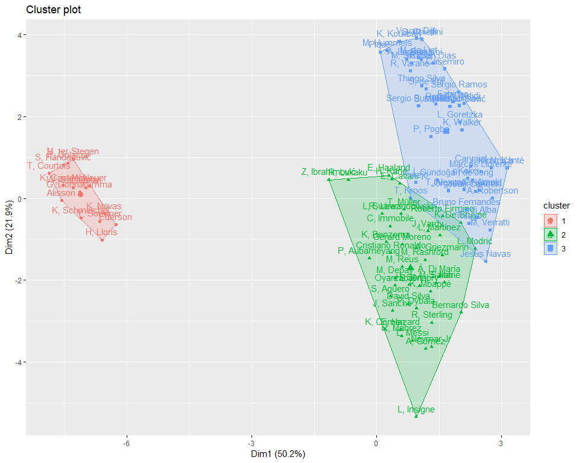

# Introduction

Dans ce travail, je me propose de vous exposer une méthode d’analyse de
données très populaire appelée l’analyse en composantes principales.
Après une brève description de cette méthode pour que vous sachiez à
quoi elle sert je ferai une application sur un jeu de données qui
contient des précieuses données sur les caractéristiques physiques des
joueurs de football. J’utiliserai le langage R avec les packages
FactoMineR et factoextra pour réaliser l’étude.

## L’ACP c’est quoi ?

L’analyse en composantes principales est une méthode mathématique et
statistique pour décrire et factoriser un jeu de données
multidimensionnelles. Par jeu de données multidimensionnelle j’entends
un tableau de données dont les lignes sont des individus sont des unités
statistiques (personnes, pays, départements …) et dont les colonnes sont
des caractéristiques observables de ces individus : age, poids, taille,
salaire pour une personne par exemple, PIB (en euro), nombre
d’habitants, budget défense pour un pays par exemple. Il est important
que les données soient multidimensionnelles pour réaliser une ACP. Si le
jeu de données contient par exmple 100 individus et deux colonnes alors
il est plus intéressant d’utiliser des méthodes de statistiques
bivariées pour étudier simultanément la distribution des colonnes (nuage
de points, coefficients de corrélation).

L’ACP fait partie de ce qu’on appelle les méthodes d’analyse
factorielle. L’ACP est utilisée lorsque les variables que nous
souhaitons étudier sont *toutes* quantitatives. La désignation **analyse
factorielle** donne un indice sur ce que fait l’ACP. En effet lorsque
nous factorisons une expression mathématiques (un polynome de 4e degré
par exemple), en réalité nous simplifions son écriture afin de nous
permettre analytiquement par exemple quels sont les racines du polynome
et comment ces racines sont liées les une autres.

Le Polynôme
*P*(*x*) = *x*4 + *x*3 − 7*x*2 − 13*x* − 6
peut être factorisé en cette expression plus simple
*P*(*x*) = (*x*+1)(*x*+1)(*x*−3)(*x*+2). Avec la forme factorisée de *P*
nous pouvons avec peu d’effort dire que *P*(1) = 0 alors qu’il faudrait
le calculer manuellement dans la forme non factorisée.

L’ACP peut être vu comme une méthode mathématique et statistique qui
nous permet de résumer un jeu de données multidimensionnelles en
réduisant ses dimensions. Le graphique suivant illustre l’objectif de la
méthode. Grâce à une ACP nous pouvons passer d’un jeu de données
(*n*\**m*) où *n* représente le nombre de lignes (observations) et *m*
le nombre de colonnes (ou variables) à un nouveau jeu de données
(*n*\**k*) où *k* &lt;  &lt; *m*. Les nouvelles colonnes que l’ACP a
créées sont appellées les composantes principales.

## Présentation du jeu de données

Le jeu de données sur lequel je vais réaliser une analyse en composantes
principales vient du site *sofifa.com*.

Sur ce site il est possible de récupérer des informations publiques sur
les joueurs de football (age, salaire, valeur, taille, poids, rapidité
…). J’ai récupéré les données des joueurs pour l’année 2022. Le jeu de
données que j’ai contient 19232 joueurs pour 74 colonnes (variables).
Par souci de simplicité nous n’allons réaliser l’analyse en composantes
principales que sur un échantillon du jeu de données. Je rends
disponible le jeu de données afin de vous permettre de reproduire
l’analyse si vous le souhaitez. Il vous suffit de référencer le lien
<https://raw.githubusercontent.com/agailloty/Outils-Analyses-R/main/dataset/fifa22.csv>
dans votre la fonction de lecture des données pour récupérer le jeu de
données.

    fifa22 <- read.csv("https://raw.githubusercontent.com/agailloty/Outils-Analyses-R/main/dataset/fifa22.csv")

## L’échantillon

Nous pouvons afficher les 10 premières lignes du jeu de données pour
avoir un aperçu des données.

    fifa22[1:10, 1:10]

              short_name player_positions overall potential value_eur wage_eur age        dob height_cm weight_kg
    1           L, Messi       RW, ST, CF      93        93  78000000   320000  34 1987-06-24       170        72
    2     R, Lewandowski               ST      92        92 119500000   270000  32 1988-08-21       185        81
    3  Cristiano Ronaldo           ST, LW      91        91  45000000   270000  36 1985-02-05       187        83
    4          Neymar Jr          LW, CAM      91        91 129000000   270000  29 1992-02-05       175        68
    5       K, De Bruyne          CM, CAM      91        91 125500000   350000  30 1991-06-28       181        70
    6           J, Oblak               GK      91        93 112000000   130000  28 1993-01-07       188        87
    7          K, Mbappé           ST, LW      91        95 194000000   230000  22 1998-12-20       182        73
    8           M, Neuer               GK      90        90  13500000    86000  35 1986-03-27       193        93
    9      M, ter Stegen               GK      90        92  99000000   250000  29 1992-04-30       187        85
    10           H, Kane               ST      90        90 129500000   240000  27 1993-07-28       188        89

# Réaliser une ACP sur le jeu de données

## Séparer les variables dans des objets R pour une meilleure visibilité.

Nous allons mettre les noms des colonnes dans des variables R pour mieux
comprendre le code.

### A quoi servent les variables quanti actives ?

Les variables quantitatives illustratives servent à calculer les
composantes de l’ACP. Elles entrent dans le calcul de la matrice de
variance-covariance.

    var_quanti_actives <- c("height_cm", "weight_kg", "skill_dribbling", "skill_ball_control",
    "movement_acceleration", "movement_agility", "power_shot_power",
    "power_jumping", "power_stamina", "power_strength", "mentality_aggression",
    "mentality_interceptions", "defending_marking_awareness",
    "defending_standing_tackle", "defending_sliding_tackle", "goalkeeping_diving",
    "goalkeeping_handling", "goalkeeping_kicking", "goalkeeping_speed")

### A quoi servent les variables quantitatives illustratives ?

Les variables illustratives n’influencent pas la construction des
composantes principales de l’analyse. Elles aident à l’interprétation
des dimensions de variabilité.

    var_quanti_illustratives <- c("overall", "potential", "value_eur", "pace", "shooting", "passing", "dribbling","defending","physic")

### A quoi servent les variables qualitatives illustratives

Comme les variables quantitatives illustratives, elles aident à
l’interprétation des composantes. Elles sont qualitatives (modalités
discrètes) : par club, par league, par nationalité …

l’ACP ne se base que sur des données numériques.

    var_quali_illustratives <- c("body_type")

### Filtrer le jeu de données

    fifa_100 <- fifa22[1:100,]

Ne prendre que les colonnes (variables) qui nous intéressent

    variables_acp <- c(var_quanti_actives, var_quanti_illustratives, var_quali_illustratives)

    fifa_100 <- fifa_100[, variables_acp]

Parmi les colonnes que nous avons sélectionnée, rien n’indique le nom
des joueurs. Si nous ne précisions pas les noms des joueurs, les joueurs
seront numérotés de 1 à 100 comme dans le tableau suivant.

    fifa_100[1:10, 1:10]

       height_cm weight_kg skill_dribbling skill_ball_control movement_acceleration movement_agility power_shot_power power_jumping power_stamina
    1        170        72              96                 96                    91               91               86            68            72
    2        185        81              85                 88                    77               77               90            85            76
    3        187        83              88                 88                    85               86               94            95            77
    4        175        68              95                 95                    93               96               80            64            81
    5        181        70              88                 91                    76               79               91            63            89
    6        188        87              12                 30                    43               67               59            78            41
    7        182        73              93                 91                    97               92               86            78            88
    8        193        93              30                 46                    54               51               68            77            43
    9        187        85              21                 30                    38               39               66            79            35
    10       188        89              83                 85                    65               71               91            79            83
       power_strength
    1              69
    2              86
    3              77
    4              53
    5              74
    6              78
    7              77
    8              80
    9              78
    10             85

    fifa_100 <- data.frame(fifa_100)
    rownames(fifa_100) <- head(fifa22$short_name, 100)

Maintenant chaque ligne correspond au nom d’un joueur.

    fifa_100[1:10, 1:10]

                      height_cm weight_kg skill_dribbling skill_ball_control movement_acceleration movement_agility power_shot_power
    L, Messi                170        72              96                 96                    91               91               86
    R, Lewandowski          185        81              85                 88                    77               77               90
    Cristiano Ronaldo       187        83              88                 88                    85               86               94
    Neymar Jr               175        68              95                 95                    93               96               80
    K, De Bruyne            181        70              88                 91                    76               79               91
    J, Oblak                188        87              12                 30                    43               67               59
    K, Mbappé               182        73              93                 91                    97               92               86
    M, Neuer                193        93              30                 46                    54               51               68
    M, ter Stegen           187        85              21                 30                    38               39               66
    H, Kane                 188        89              83                 85                    65               71               91
                      power_jumping power_stamina power_strength
    L, Messi                     68            72             69
    R, Lewandowski               85            76             86
    Cristiano Ronaldo            95            77             77
    Neymar Jr                    64            81             53
    K, De Bruyne                 63            89             74
    J, Oblak                     78            41             78
    K, Mbappé                    78            88             77
    M, Neuer                     77            43             80
    M, ter Stegen                79            35             78
    H, Kane                      79            83             85

## Réalisation de l’ACP avec FactoMineR

Pour réaliser une ACP avec FactoMineR, il fournir à la fonction PCA les
arguments suivants :

-   X : le jeu de données
-   scale.unit : TRUE ou FALSE (pour réduire et centrer les données
    numériques)
-   ncp : Le nombre de composantes principales
-   quanti.sup : Les indices des variables quantitatives illustratives
-   quali.sup : Les indices des variables qualitatives illustratives
-   ind.sup : Les indices des lignes contenant les individus
    illustratifs.
-   graph : TRUE ou FALSE pour indiquer si R doit afficher les
    graphiques de l’ACP

Nous ne sommes pas obligés de renseigner tous les paramètres de la
fonction PCA.

La condition minimale à satisfaire pour réaliser une ACP avec la
fonction PCA c’est de fournir en argument au paramètre X un jeu de
données ne contenant que des variables numériques et ne contenant aucune
donnée manquante.

Dans ce cas une ACP sera réalisée en considérant toutes les colonnes
comme variables actives.

Dans la pratique nous voulons avoir un contrôle sur les résultats de
l’ACP donc nous allons donner plus de précisions à la fonction PCA.

Dans notre présent cas nous allons préciser les indices des variables
actives, variables quantitatives illustratives et des variables
qualitatives illustratives.

### Trouver les positions des colonnes dans le jeu de données

    idx_var_actives <- match(var_quanti_actives, colnames(fifa_100))

    idx_var_quanti_illustratives <- match(var_quanti_illustratives, colnames(fifa_100))

    idx_var_quali_illustratives <- match(var_quali_illustratives, colnames(fifa_100))

    # Charger la librairie FactoMineR
    library(FactoMineR)
    library(factoextra) # Pour représenter graphiques

    premiere_acp <- PCA(X = fifa_100, scale.unit = TRUE, quanti.sup = idx_var_quanti_illustratives, 
                        quali.sup = idx_var_quali_illustratives, graph = FALSE)

    Warning in PCA(X = fifa_100, scale.unit = TRUE, quanti.sup = idx_var_quanti_illustratives, : Missing values are imputed by the mean of the
    variable: you should use the imputePCA function of the missMDA package

## Combien de composantes retenir ?

Comme tout objet dans R, nous pouvons utiliser la fonction `summary()`
sur l’objet *premiere\_acp* pour afficher certaines informations.

    summary(premiere_acp)

    Call:
    PCA(X = fifa_100, scale.unit = TRUE, quanti.sup = idx_var_quanti_illustratives,  
         quali.sup = idx_var_quali_illustratives, graph = FALSE) 

    Eigenvalues
                           Dim.1   Dim.2   Dim.3   Dim.4   Dim.5   Dim.6   Dim.7   Dim.8   Dim.9  Dim.10  Dim.11  Dim.12  Dim.13  Dim.14  Dim.15
    Variance               9.547   4.167   1.873   1.047   0.767   0.369   0.285   0.217   0.167   0.156   0.130   0.080   0.055   0.046   0.028
    % of var.             50.248  21.933   9.860   5.509   4.037   1.941   1.501   1.141   0.882   0.819   0.685   0.423   0.288   0.240   0.149
    Cumulative % of var.  50.248  72.181  82.041  87.549  91.586  93.527  95.029  96.170  97.051  97.871  98.555  98.978  99.266  99.506  99.655
                          Dim.16  Dim.17  Dim.18  Dim.19
    Variance               0.022   0.019   0.016   0.009
    % of var.              0.115   0.100   0.085   0.045
    Cumulative % of var.  99.770  99.870  99.955 100.000

    Individuals (the 10 first)
                                    Dist    Dim.1    ctr   cos2    Dim.2    ctr   cos2    Dim.3    ctr   cos2  
    L, Messi                    |  3.928 |  0.864  0.078  0.048 | -3.479  2.905  0.784 |  0.758  0.306  0.037 |
    R, Lewandowski              |  2.857 |  0.591  0.037  0.043 | -0.374  0.033  0.017 |  2.560  3.497  0.803 |
    Cristiano Ronaldo           |  3.758 |  0.342  0.012  0.008 | -1.332  0.426  0.126 |  3.179  5.395  0.716 |
    Neymar Jr                   |  3.933 |  1.321  0.183  0.113 | -3.624  3.151  0.849 | -0.177  0.017  0.002 |
    K, De Bruyne                |  2.615 |  2.024  0.429  0.599 | -0.590  0.084  0.051 |  0.008  0.000  0.000 |
    J, Oblak                    |  7.200 | -6.992  5.121  0.943 |  0.261  0.016  0.001 | -0.362  0.070  0.003 |
    K, Mbappé                   |  3.419 |  1.301  0.177  0.145 | -2.278  1.245  0.444 |  1.812  1.753  0.281 |
    M, Neuer                    |  7.505 | -6.894  4.978  0.844 |  0.310  0.023  0.002 |  0.693  0.257  0.009 |
    M, ter Stegen               |  8.221 | -7.291  5.568  0.786 |  0.954  0.218  0.013 | -0.068  0.002  0.000 |
    H, Kane                     |  2.843 |  0.364  0.014  0.016 |  0.467  0.052  0.027 |  2.501  3.339  0.774 |

    Variables (the 10 first)
                                   Dim.1    ctr   cos2    Dim.2    ctr   cos2    Dim.3    ctr   cos2  
    height_cm                   | -0.532  2.970  0.284 |  0.623  9.302  0.388 |  0.374  7.474  0.140 |
    weight_kg                   | -0.579  3.517  0.336 |  0.544  7.111  0.296 |  0.490 12.823  0.240 |
    skill_dribbling             |  0.910  8.677  0.828 | -0.304  2.215  0.092 |  0.181  1.756  0.033 |
    skill_ball_control          |  0.930  9.052  0.864 | -0.228  1.251  0.052 |  0.151  1.209  0.023 |
    movement_acceleration       |  0.649  4.416  0.422 | -0.532  6.793  0.283 |  0.180  1.726  0.032 |
    movement_agility            |  0.618  4.006  0.382 | -0.692 11.478  0.478 |  0.013  0.010  0.000 |
    power_shot_power            |  0.570  3.404  0.325 | -0.283  1.921  0.080 |  0.597 18.995  0.356 |
    power_jumping               |  0.133  0.185  0.018 |  0.484  5.630  0.235 |  0.421  9.482  0.178 |
    power_stamina               |  0.931  9.080  0.867 | -0.021  0.011  0.000 |  0.027  0.038  0.001 |
    power_strength              | -0.003  0.000  0.000 |  0.717 12.345  0.514 |  0.590 18.551  0.348 |

    Supplementary continuous variables
                                   Dim.1   cos2    Dim.2   cos2    Dim.3   cos2  
    overall                     | -0.175  0.031 | -0.150  0.022 |  0.245  0.060 |
    potential                   | -0.120  0.014 | -0.034  0.001 |  0.247  0.061 |
    value_eur                   |  0.197  0.039 | -0.151  0.023 |  0.217  0.047 |
    pace                        |  0.018  0.000 | -0.514  0.264 |  0.234  0.055 |
    shooting                    | -0.062  0.004 | -0.675  0.456 |  0.475  0.226 |
    passing                     |  0.065  0.004 | -0.584  0.341 | -0.213  0.045 |
    dribbling                   |  0.031  0.001 | -0.860  0.740 |  0.006  0.000 |
    defending                   |  0.138  0.019 |  0.827  0.683 | -0.501  0.251 |
    physic                      |  0.021  0.000 |  0.783  0.613 |  0.368  0.135 |

    Supplementary categories
                                    Dist    Dim.1   cos2 v.test    Dim.2   cos2 v.test    Dim.3   cos2 v.test  
    Lean (170-)                 |  4.652 |  2.626  0.319  0.850 | -1.551  0.111 -0.760 | -3.182  0.468 -2.325 |
    Lean (170-185)              |  1.998 |  1.800  0.811  1.932 | -0.285  0.020 -0.462 | -0.714  0.128 -1.729 |
    Lean (185+)                 |  2.085 | -1.133  0.295 -0.745 |  1.406  0.455  1.399 | -0.381  0.033 -0.565 |
    Normal (170-)               |  4.242 |  1.185  0.078  0.383 | -3.678  0.752 -1.802 | -1.022  0.058 -0.747 |
    Normal (170-185)            |  1.039 |  0.458  0.194  0.464 |  0.123  0.014  0.189 | -0.690  0.441 -1.577 |
    Normal (185+)               |  2.883 | -1.948  0.457 -1.850 |  2.016  0.489  2.898 | -0.166  0.003 -0.356 |
    Stocky (185+)               |  7.414 | -7.103  0.918 -2.299 | -0.482  0.004 -0.236 | -0.869  0.014 -0.635 |
    Unique                      |  0.437 |  0.020  0.002  0.088 | -0.217  0.246 -1.472 |  0.322  0.544  3.264 |

L’objet eig nous renvoie un tbaleau qui nous permet de déterminer
combien de composantes retenir dans l’ACP.

La règle de Kaiser-Guttman **“Le nombre des valeurs-propres supérieures
à l’unité d’une matrice d’inter-corrélation est égal au nombre de
facteur à extraire”**.

La règle de Kaiser nous aide à sélectionner le nombre optimal de
composantes à retenir dans l’analyse. Nous regardons les valeurs de
eigenvalues &gt;= 1. Dans le présent exemple nous allons retenir 4
composantes car à partir de la 5e composante la valeur propre est
inférieure à 1.

    data.frame(premiere_acp$eig)

             eigenvalue percentage.of.variance cumulative.percentage.of.variance
    comp 1  9.547132954            50.24806818                          50.24807
    comp 2  4.167230676            21.93279303                          72.18086
    comp 3  1.873381812             9.85990427                          82.04077
    comp 4  1.046617990             5.50851574                          87.54928
    comp 5  0.766990307             4.03679109                          91.58607
    comp 6  0.368793722             1.94101959                          93.52709
    comp 7  0.285276150             1.50145342                          95.02855
    comp 8  0.216790603             1.14100317                          96.16955
    comp 9  0.167494930             0.88155226                          97.05110
    comp 10 0.155690900             0.81942579                          97.87053
    comp 11 0.130089532             0.68468175                          98.55521
    comp 12 0.080333643             0.42280865                          98.97802
    comp 13 0.054677465             0.28777613                          99.26579
    comp 14 0.045622429             0.24011805                          99.50591
    comp 15 0.028253459             0.14870242                          99.65461
    comp 16 0.021933695             0.11544050                          99.77005
    comp 17 0.019068931             0.10036279                          99.87042
    comp 18 0.016061778             0.08453567                          99.95495
    comp 19 0.008559024             0.04504750                         100.00000

Chaque composante résume la variance (intertie) du jeu de donnée. Par
exemple, la première composante explique à elle seule 50% de la variance
du jeu de données. La composante 2 explique 22% de la variance, la
composante 3 explique 9,0% etc…

Cumulativement les 4 composantes que nous retiendront dans l’analyse
expliquent 87% de la variance totale du jeu de données.

Nous avons sélectionné 19 variables actives dans l’analyse en
composantes principales. Ces variables sont **height\_cm, weight\_kg,
skill\_dribbling, skill\_ball\_control, movement\_acceleration,
movement\_agility, power\_shot\_power, power\_jumping, power\_stamina,
power\_strength, mentality\_aggression, mentality\_interceptions,
defending\_marking\_awareness, defending\_standing\_tackle,
defending\_sliding\_tackle, goalkeeping\_diving, goalkeeping\_handling,
goalkeeping\_kicking, goalkeeping\_speed**.

Grâce à l’ACP nous avons pû extraire 87% de l’information (l’inertie /
variance) contenue dans 19 variables grâce à 4 variables synthétiques
que nous appelons composantes principales.

Le reste de l’analyse consite donc à décomposer quelles variables
initiales (variables actives) entrent dans la composition de chacune des
composantes.

## Description des composantes

Une composante (ou dimension) est une variable synthétique formée comme
une combinaison linéaire des variables initiales contenues dans le jeu
de données.

    head(premiere_acp$ind$coord)

                           Dim.1      Dim.2        Dim.3       Dim.4       Dim.5
    L, Messi           0.8639975 -3.4791101  0.757518877 -0.09909159  0.08123285
    R, Lewandowski     0.5911543 -0.3735085  2.559612629  0.09019679  0.31107219
    Cristiano Ronaldo  0.3422720 -1.3324889  3.179235062  0.31692814  1.05088042
    Neymar Jr          1.3212620 -3.6237944 -0.177133227 -0.10031339  0.15858556
    K, De Bruyne       2.0244058 -0.5900705  0.007897385 -0.31451301 -0.97310435
    J, Oblak          -6.9919111  0.2609832 -0.361708412  0.10880091  0.97593474

### Composante 1

Nous utilisons la fonction `dimdesc()` pour afficher des informations
permettant de décrire une dimension.

    dimdesc(premiere_acp, axes = 1)

    $Dim.1

    Link between the variable and the continuous variables (R-square)
    =================================================================================
                                correlation      p.value
    power_stamina                 0.9310608 1.057853e-44
    skill_ball_control            0.9296284 2.798423e-44
    skill_dribbling               0.9101928 2.692916e-39
    mentality_aggression          0.7834201 5.824363e-22
    defending_standing_tackle     0.7160741 5.565933e-17
    mentality_interceptions       0.6825780 5.238686e-15
    defending_sliding_tackle      0.6715655 2.051306e-14
    defending_marking_awareness   0.6704033 2.361122e-14
    movement_acceleration         0.6492827 2.737652e-13
    movement_agility              0.6184369 7.073146e-12
    power_shot_power              0.5701057 5.968991e-10
    value_eur                     0.1972808 4.913873e-02
    height_cm                    -0.5324573 1.185330e-08
    weight_kg                    -0.5794330 2.682184e-10
    goalkeeping_kicking          -0.9460502 9.222093e-50
    goalkeeping_diving           -0.9542690 3.417323e-53
    goalkeeping_handling         -0.9598525 6.620247e-56

    Link between variable abd the categories of the categorical variables
    ================================================================
                             Estimate    p.value
    body_type=Stocky (185+) -6.591048 0.02073359

### Composante 2

Nous utilisons la fonction `dimdesc()` pour afficher des informations
permettant de décrire une dimension.

    dimdesc(premiere_acp, axes = 2)

    $Dim.2

    Link between the variable and the continuous variables (R-square)
    =================================================================================
                                correlation      p.value
    defending                     0.8266670 3.253779e-26
    physic                        0.7826747 6.758755e-22
    power_strength                0.7172355 4.699250e-17
    defending_sliding_tackle      0.6344015 1.375379e-12
    height_cm                     0.6226199 4.647055e-12
    mentality_interceptions       0.6147787 1.016163e-11
    defending_marking_awareness   0.6110181 1.467626e-11
    defending_standing_tackle     0.6102678 1.578390e-11
    weight_kg                     0.5443635 4.792828e-09
    power_jumping                 0.4843844 3.285453e-07
    mentality_aggression          0.4630878 1.225685e-06
    skill_ball_control           -0.2283309 2.232021e-02
    power_shot_power             -0.2829131 4.343500e-03
    skill_dribbling              -0.3038003 2.120761e-03
    pace                         -0.5136892 4.610158e-08
    movement_acceleration        -0.5320392 1.222851e-08
    passing                      -0.5840214 1.792800e-10
    shooting                     -0.6751369 1.326081e-14
    movement_agility             -0.6916079 1.634877e-15
    dribbling                    -0.8601548 2.059502e-30

    Link between the variable and the categorical variable (1-way anova)
    =============================================
                     R2   p.value
    body_type 0.1455218 0.0379278

    Link between variable abd the categories of the categorical variables
    ================================================================
                            Estimate     p.value
    body_type=Normal (185+) 2.349482 0.003283813

### Composante 3

Nous utilisons la fonction `dimdesc()` pour afficher des informations
permettant de décrire une dimension.

    dimdesc(premiere_acp, axes = 3)

    $Dim.3

    Link between the variable and the continuous variables (R-square)
    =================================================================================
                                correlation      p.value
    power_shot_power              0.5965309 5.786781e-11
    power_strength                0.5895215 1.096965e-10
    weight_kg                     0.4901275 2.268130e-07
    shooting                      0.4749392 5.956005e-07
    power_jumping                 0.4214601 1.260597e-05
    height_cm                     0.3741842 1.255169e-04
    physic                        0.3677805 1.669526e-04
    potential                     0.2473631 1.309335e-02
    overall                       0.2446758 1.415090e-02
    pace                          0.2335800 1.934134e-02
    value_eur                     0.2174076 2.979520e-02
    passing                      -0.2129004 3.344647e-02
    defending_standing_tackle    -0.2886445 3.586468e-03
    defending_sliding_tackle     -0.3325388 7.240194e-04
    mentality_interceptions      -0.3378593 5.864856e-04
    defending_marking_awareness  -0.3583304 2.516312e-04
    defending                    -0.5012765 1.083267e-07

    Link between the variable and the categorical variable (1-way anova)
    =============================================
                     R2    p.value
    body_type 0.1545651 0.02644843

    Link between variable abd the categories of the categorical variables
    ================================================================
                           Estimate      p.value
    body_type=Unique       1.159901 0.0008619509
    body_type=Lean (170-) -2.344258 0.0193078278

## Représentations graphiques

### Les variables : Le cercle des corrélations

Le graphique suivant s’appelle le cercle de corrélation. On représente
simultanément deux dimensions (axes). On lit ce graphique de gauche à
droite puis de bas en haut. Les axes représentent des corrélations. Si
une variable pointe vers la gauche, c’est qu’elle est négativement
corrélée à l’axe 1 et vice versa. Si une variable pointe vers le bas
elle est négativement corrélée à l’axe 2 et vice versa. Ce graphique
nous permet de voir quelles variables s’opposent entre elles sur chaque
axe.

    plot.PCA(premiere_acp, axes = c(1, 2), choix = "var")

## Graphique des individus

    plot.PCA(premiere_acp, axes = c(1, 2), choix = "ind")

## Personnalisation des graphiques avec `factoextra`

### Représenter le cercle de corrélation puis mettre en avant la contribution de chaque variable

    fviz_pca_var(premiere_acp, col.var="contrib", axes = c(1,2), gradient.cols = c("blue", "yellow", "red"), title = "Cercle des corrélations avec contribution de chaque variable")

### Représenter le % de contribution de chaque variable sur les axes 1 et 2

    fviz_contrib(premiere_acp, choice = "var", axes = 1)

    fviz_contrib(premiere_acp, choice = "var", axes = 2)

# Classification ascendate hiérarchique (CAH)

## Catégroriser les joueurs en groupes homogènes

On a un jeu de données de 100 joueurs, comment peut-on classer les
joueurs en 5 groupes homogènes ? On utilise la fonction HCPC du package
FactoMineR, en précisant en argument l’objet acp qu’on a créé avec la
fonction PCA, puis on précise le nombre de clusters (groupes, classes)
qu’on veut produire. L’argument graph = FALSE instruit R de ne
représenter les résultats graphiquement.

    classif <- HCPC(premiere_acp, nb.clust = 5, graph = FALSE)

## Description de chaque cluster

On peut utiliser une propriété de l’objet classif pour afficher la
description de chaque cluster.

    classif$desc.axes

    Link between the cluster variable and the quantitative variables
    ================================================================
               Eta2      P-value
    Dim.1 0.9710515 3.985630e-72
    Dim.2 0.8407178 5.188359e-37
    Dim.3 0.6293291 1.039484e-19

    Description of each cluster by quantitative variables
    =====================================================
    $`1`
            v.test Mean in category Overall mean sd in category Overall sd      p.value
    Dim.1 -9.61829         -7.11018 6.931955e-16      0.4384079   3.089844 6.693444e-22

    $`2`
            v.test Mean in category Overall mean sd in category Overall sd      p.value
    Dim.3 6.592117         2.455677 4.058733e-16      0.7196673   1.368715 4.335989e-11

    $`3`
             v.test Mean in category  Overall mean sd in category Overall sd      p.value
    Dim.1  2.063221         1.002524  6.931955e-16      0.4640714   3.089844 3.909160e-02
    Dim.2 -7.184421        -2.306366 -1.407095e-15      1.0784803   2.041380 6.749241e-13

    $`4`
            v.test Mean in category  Overall mean sd in category Overall sd      p.value
    Dim.2 7.771677         2.917443 -1.407095e-15      0.6613834   2.041380 7.745396e-15
    Dim.1 2.214230         1.258123  6.931955e-16      0.5733747   3.089844 2.681297e-02

    $`5`
             v.test Mean in category Overall mean sd in category Overall sd     p.value
    Dim.1  3.673506         2.212603 6.931955e-16      0.5615386   3.089844 2.39245e-04
    Dim.3 -5.086956        -1.357242 4.058733e-16      0.8761187   1.368715 3.63857e-07

Ces résultats nous permettent de savoir quelle(s) composante(s)
caractérisent les mieux les individus qui appartiennent à un cluster. On
a créé 5 clusters, le tableau affiche donc les caractéristiques de
chaque cluster.

v.test: c’est une statistique calculée qui permet de tester la
significativité du lien du cluster avec le(s) composante(s). Si sa
valeur est supérieure à 1.96 c’est que le lien entre le cluster et l’axe
est significatif. Il y a un lien entre v.test et la p.value. Plus la
v.test est grande moins la p.value sera. Une p.value inférieure ou égale
à 0.05 indique que le test statistique est significatif.

Le signe de la v.test Si positif : les individus qui sont dans le
cluster ont en moyenne une coordonnée positive sur l’axe considérée

Si négatif : les individus qui sont dans le cluster ont en moyenne une
coordonnée négative sur l’axe considérée.

Interprétation résultat cluster 1 Les individus qui sont dans le cluster
sont caractérisés essentiellement par la dimension 1. Les joueurs qui
sont classés dans ce clusters ont en moyenne une coordonnée égale à
-7.11018 tandis que dans le reste du jeu de données les joueurs ont en
moyenne une coordonnée de 6.931955e-16 (proche de 0) sur cette
dimension.

## Les individus parangon

Le but de la classification ascendante hiérarchique c’est de regrouper
les individus qui se ressemblent le plus (minimiser la variance intra
cluster) et faire en sorte que chaque cluster diffère d’un autre
(maximiser la variance entre chaque cluster).

Les individus parangon sont les individus qui se rapprochent le plus du
centre de chaque cluster. Ce sont les individus “moyens” de chaque
cluster. C’est eux qui caractérisent le mieux le cluster étudié.

    classif$desc.ind$para

    Cluster: 1
    G, Donnarumma   W, Szczęsny      J, Oblak     Y, Sommer       Alisson 
        0.7437392     0.7764569     0.8745005     1.1648592     1.7734468 
    ---------------------------------------------------------------------------------------------------------- 
    Cluster: 2
    R, Lewandowski        H, Kane    C, Immobile      L, Suárez     K, Benzema 
         0.7057555      0.7562182      0.8249288      0.9437102      0.9907515 
    ---------------------------------------------------------------------------------------------------------- 
    Cluster: 3
      S, Gnabry    M, Salah   P, Dybala   Oyarzabal Á, Di María 
      0.5125072   0.5198456   0.5664524   0.6265379   0.7321610 
    ---------------------------------------------------------------------------------------------------------- 
    Cluster: 4
      Rúben Dias   L, Bonucci Thiago Silva   A, Laporte   S, de Vrij 
       0.6053112    0.7313895    0.7423503    0.8298838    0.8657299 
    ---------------------------------------------------------------------------------------------------------- 
    Cluster: 5
    T, Alexander-Arnold        João Cancelo        A, Robertson          F, de Jong     Bruno Fernandes 
              0.4016233           0.5214053           0.8291440           0.9979184           1.0795893 

## Les individus spécifiques

Ce sont les individus les plus éloignés du centre du cluster. On aurait
pu les mettre dans un autre cluster. Ils sont à la frontière de
plusieurs clusters.

    classif$desc.ind$dist

    Cluster: 1
      H, Lloris     Ederson  P, Gulácsi T, Courtois K, Casteels 
       9.402346    9.207166    8.921628    8.706093    8.660642 
    ---------------------------------------------------------------------------------------------------------- 
    Cluster: 2
       Z, Ibrahimović         R, Lukaku        E, Haaland           H, Kane Cristiano Ronaldo 
             4.787525          4.584261          4.415862          3.669592          3.280196 
    ---------------------------------------------------------------------------------------------------------- 
    Cluster: 3
    L, Insigne   A, Gómez  E, Hazard  Neymar Jr  R, Mahrez 
      5.575780   3.977211   3.952106   3.924649   3.877662 
    ---------------------------------------------------------------------------------------------------------- 
    Cluster: 4
      M, Hummels G, Chiellini K, Koulibaly  V, van Dijk        Piqué 
        4.506813     4.489410     4.364257     4.351577     4.284480 
    ---------------------------------------------------------------------------------------------------------- 
    Cluster: 5
        T, Kroos  M, Verratti       Parejo  Jesús Navas A, Robertson 
        4.947775     4.490787     3.922122     3.917639     3.701767 

    factoextra::fviz_cluster(classif, repel = TRUE, title = "Représentation des clusters")

    Warning: argument title is deprecated; please use main instead.

    Warning: ggrepel: 19 unlabeled data points (too many overlaps). Consider increasing max.overlaps

    fviz_dend(classif)

    classif2 <- HCPC(premiere_acp, graph = FALSE)

    fviz_cluster(classif2)

# Annexes

## Résumé des résultats

    summary(premiere_acp)

    Call:
    PCA(X = fifa_100, scale.unit = TRUE, quanti.sup = idx_var_quanti_illustratives,  
         quali.sup = idx_var_quali_illustratives, graph = FALSE) 

    Eigenvalues
                           Dim.1   Dim.2   Dim.3   Dim.4   Dim.5   Dim.6   Dim.7   Dim.8   Dim.9  Dim.10  Dim.11  Dim.12  Dim.13  Dim.14  Dim.15
    Variance               9.547   4.167   1.873   1.047   0.767   0.369   0.285   0.217   0.167   0.156   0.130   0.080   0.055   0.046   0.028
    % of var.             50.248  21.933   9.860   5.509   4.037   1.941   1.501   1.141   0.882   0.819   0.685   0.423   0.288   0.240   0.149
    Cumulative % of var.  50.248  72.181  82.041  87.549  91.586  93.527  95.029  96.170  97.051  97.871  98.555  98.978  99.266  99.506  99.655
                          Dim.16  Dim.17  Dim.18  Dim.19
    Variance               0.022   0.019   0.016   0.009
    % of var.              0.115   0.100   0.085   0.045
    Cumulative % of var.  99.770  99.870  99.955 100.000

    Individuals (the 10 first)
                                    Dist    Dim.1    ctr   cos2    Dim.2    ctr   cos2    Dim.3    ctr   cos2  
    L, Messi                    |  3.928 |  0.864  0.078  0.048 | -3.479  2.905  0.784 |  0.758  0.306  0.037 |
    R, Lewandowski              |  2.857 |  0.591  0.037  0.043 | -0.374  0.033  0.017 |  2.560  3.497  0.803 |
    Cristiano Ronaldo           |  3.758 |  0.342  0.012  0.008 | -1.332  0.426  0.126 |  3.179  5.395  0.716 |
    Neymar Jr                   |  3.933 |  1.321  0.183  0.113 | -3.624  3.151  0.849 | -0.177  0.017  0.002 |
    K, De Bruyne                |  2.615 |  2.024  0.429  0.599 | -0.590  0.084  0.051 |  0.008  0.000  0.000 |
    J, Oblak                    |  7.200 | -6.992  5.121  0.943 |  0.261  0.016  0.001 | -0.362  0.070  0.003 |
    K, Mbappé                   |  3.419 |  1.301  0.177  0.145 | -2.278  1.245  0.444 |  1.812  1.753  0.281 |
    M, Neuer                    |  7.505 | -6.894  4.978  0.844 |  0.310  0.023  0.002 |  0.693  0.257  0.009 |
    M, ter Stegen               |  8.221 | -7.291  5.568  0.786 |  0.954  0.218  0.013 | -0.068  0.002  0.000 |
    H, Kane                     |  2.843 |  0.364  0.014  0.016 |  0.467  0.052  0.027 |  2.501  3.339  0.774 |

    Variables (the 10 first)
                                   Dim.1    ctr   cos2    Dim.2    ctr   cos2    Dim.3    ctr   cos2  
    height_cm                   | -0.532  2.970  0.284 |  0.623  9.302  0.388 |  0.374  7.474  0.140 |
    weight_kg                   | -0.579  3.517  0.336 |  0.544  7.111  0.296 |  0.490 12.823  0.240 |
    skill_dribbling             |  0.910  8.677  0.828 | -0.304  2.215  0.092 |  0.181  1.756  0.033 |
    skill_ball_control          |  0.930  9.052  0.864 | -0.228  1.251  0.052 |  0.151  1.209  0.023 |
    movement_acceleration       |  0.649  4.416  0.422 | -0.532  6.793  0.283 |  0.180  1.726  0.032 |
    movement_agility            |  0.618  4.006  0.382 | -0.692 11.478  0.478 |  0.013  0.010  0.000 |
    power_shot_power            |  0.570  3.404  0.325 | -0.283  1.921  0.080 |  0.597 18.995  0.356 |
    power_jumping               |  0.133  0.185  0.018 |  0.484  5.630  0.235 |  0.421  9.482  0.178 |
    power_stamina               |  0.931  9.080  0.867 | -0.021  0.011  0.000 |  0.027  0.038  0.001 |
    power_strength              | -0.003  0.000  0.000 |  0.717 12.345  0.514 |  0.590 18.551  0.348 |

    Supplementary continuous variables
                                   Dim.1   cos2    Dim.2   cos2    Dim.3   cos2  
    overall                     | -0.175  0.031 | -0.150  0.022 |  0.245  0.060 |
    potential                   | -0.120  0.014 | -0.034  0.001 |  0.247  0.061 |
    value_eur                   |  0.197  0.039 | -0.151  0.023 |  0.217  0.047 |
    pace                        |  0.018  0.000 | -0.514  0.264 |  0.234  0.055 |
    shooting                    | -0.062  0.004 | -0.675  0.456 |  0.475  0.226 |
    passing                     |  0.065  0.004 | -0.584  0.341 | -0.213  0.045 |
    dribbling                   |  0.031  0.001 | -0.860  0.740 |  0.006  0.000 |
    defending                   |  0.138  0.019 |  0.827  0.683 | -0.501  0.251 |
    physic                      |  0.021  0.000 |  0.783  0.613 |  0.368  0.135 |

    Supplementary categories
                                    Dist    Dim.1   cos2 v.test    Dim.2   cos2 v.test    Dim.3   cos2 v.test  
    Lean (170-)                 |  4.652 |  2.626  0.319  0.850 | -1.551  0.111 -0.760 | -3.182  0.468 -2.325 |
    Lean (170-185)              |  1.998 |  1.800  0.811  1.932 | -0.285  0.020 -0.462 | -0.714  0.128 -1.729 |
    Lean (185+)                 |  2.085 | -1.133  0.295 -0.745 |  1.406  0.455  1.399 | -0.381  0.033 -0.565 |
    Normal (170-)               |  4.242 |  1.185  0.078  0.383 | -3.678  0.752 -1.802 | -1.022  0.058 -0.747 |
    Normal (170-185)            |  1.039 |  0.458  0.194  0.464 |  0.123  0.014  0.189 | -0.690  0.441 -1.577 |
    Normal (185+)               |  2.883 | -1.948  0.457 -1.850 |  2.016  0.489  2.898 | -0.166  0.003 -0.356 |
    Stocky (185+)               |  7.414 | -7.103  0.918 -2.299 | -0.482  0.004 -0.236 | -0.869  0.014 -0.635 |
    Unique                      |  0.437 |  0.020  0.002  0.088 | -0.217  0.246 -1.472 |  0.322  0.544  3.264 |

# Bibliographie

Kassambara A, Mundt F (2020). *factoextra: Extract and Visualize the
Results of Multivariate Data Analyses*. R package version 1.0.7,
<https://CRAN.R-project.org/package=factoextra>.

JJ Allaire and Yihui Xie and Jonathan McPherson and Javier Luraschi and
Kevin Ushey and Aron Atkins and Hadley Wickham and Joe Cheng and Winston
Chang and Richard Iannone (2023). rmarkdown: Dynamic Documents for R. R
package version 2.20. URL <https://rmarkdown.rstudio.com>.

Yihui Xie and J.J. Allaire and Garrett Grolemund (2018). R Markdown: The
Definitive Guide. Chapman and Hall/CRC. ISBN 9781138359338. URL
<https://bookdown.org/yihui/rmarkdown>.

Yihui Xie and Christophe Dervieux and Emily Riederer (2020). R Markdown
Cookbook. Chapman and Hall/CRC. ISBN 9780367563837. URL
<https://bookdown.org/yihui/rmarkdown-cookbook>.

Xie Y (2016). *bookdown: Authoring Books and Technical Documents with R
Markdown*. Chapman and Hall/CRC, Boca Raton, Florida. ISBN
978-1138700109, <https://bookdown.org/yihui/bookdown>.

Sebastien Le, Julie Josse, Francois Husson (2008). FactoMineR: An R
Package for Multivariate Analysis. Journal of Statistical Software,
25(1), 1-18. 10.18637/jss.v025.i01

Wickham H, François R, Henry L, Müller K, Vaughan D (2023). *dplyr: A
Grammar of Data Manipulation*. R package version 1.1.0,
<https://CRAN.R-project.org/package=dplyr>.
