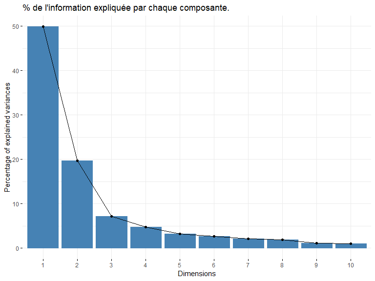
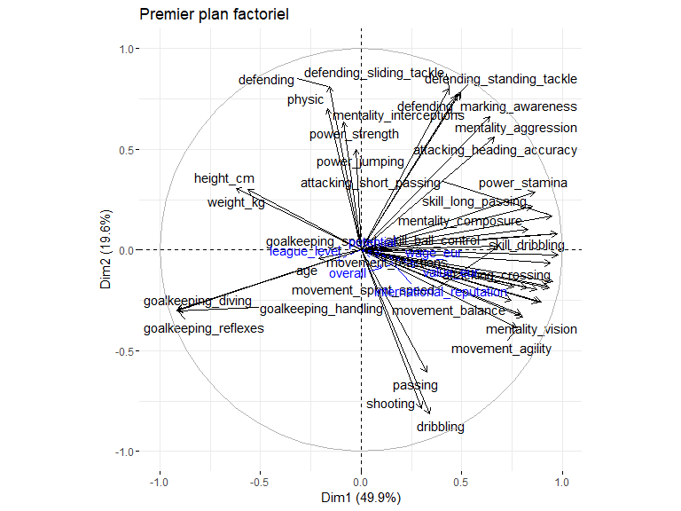

# Introduction

Dans ce travail, je me propose de vous exposer une méthode d’analyse de
données très populaire appelée l’analyse en composantes principales
(ACP). Après une brève description de cette méthode pour que vous
sachiez à quoi elle sert je ferai une application sur un jeu de données
qui contient des précieuses données sur les caractéristiques physiques
des joueurs de football. Après avoir analysé le jeu de données avec
l’ACP je ferai une classification ascendante hiérarchique en vue de
regrouper les joueurs dans des groupes homogènes. J’utiliserai le
langage R avec les packages FactoMineR et factoextra pour réaliser
l’étude.

## L’ACP c’est quoi ?

L’analyse en composantes principales est une méthode mathématique et
statistique pour décrire et factoriser un jeu de données
multidimensionnelles. Par jeu de données multidimensionnelle j’entends
un tableau de données dont les lignes sont des individus sont des unités
statistiques (personnes, pays, départements …) et dont les colonnes sont
des caractéristiques observables de ces individus : age, poids, taille,
salaire pour une personne par exemple, PIB (en euro), nombre
d’habitants, budget défense pour un pays par exemple. Il est important
que les données soient multidimensionnelles pour réaliser une ACP. Si le
jeu de données contient par exmple 100 individus et deux colonnes alors
il est plus intéressant d’utiliser des méthodes de statistiques
bivariées pour étudier simultanément la distribution des colonnes (nuage
de points, coefficients de corrélation).

L’ACP fait partie de ce qu’on appelle les méthodes d’analyse
factorielle. L’ACP est utilisée lorsque les variables que nous
souhaitons étudier sont *toutes* quantitatives. La désignation **analyse
factorielle** donne un indice sur ce que fait l’ACP. En effet lorsque
nous factorisons une expression mathématiques (un polynome de 4e degré
par exemple), en réalité nous simplifions son écriture afin de nous
permettre analytiquement par exemple quels sont les racines du polynome
et comment ces racines sont liées les une autres.

Le Polynôme
*P*(*x*) = *x*4 + *x*3 − 7*x*2 − 13*x* − 6
peut être factorisé en cette expression plus simple
*P*(*x*) = (*x*+1)(*x*+1)(*x*−3)(*x*+2). Avec la forme factorisée de *P*
nous pouvons avec peu d’effort dire que *P*(1) = 0 alors qu’il faudrait
le calculer manuellement dans la forme non factorisée.

L’ACP peut être vu comme une méthode mathématique et statistique qui
nous permet de résumer un jeu de données multidimensionnelles en
réduisant ses dimensions. Le graphique suivant illustre l’objectif de la
méthode. Grâce à une ACP nous pouvons passer d’un jeu de données
(*n*\**m*) où *n* représente le nombre de lignes (observations) et *m*
le nombre de colonnes (ou variables) à un nouveau jeu de données
(*n*\**k*) où *k* &lt;  &lt; *m*. Les nouvelles colonnes que l’ACP a
créées sont appellées les composantes principales.

## Présentation du jeu de données

Le jeu de données sur lequel je vais réaliser une analyse en composantes
principales vient du site *sofifa.com*.

Sur ce site il est possible de récupérer des informations publiques sur
les joueurs de football (age, salaire, valeur, taille, poids, rapidité
…). J’ai récupéré les données des joueurs pour l’année 2022. Le jeu de
données que j’ai contient 19232 joueurs pour 74 colonnes (variables).
Par souci de simplicité nous n’allons réaliser l’analyse en composantes
principales que sur un échantillon du jeu de données. Je rends
disponible le jeu de données afin de vous permettre de reproduire
l’analyse si vous le souhaitez. Il vous suffit de référencer le lien
<https://raw.githubusercontent.com/agailloty/Outils-Analyses-R/main/dataset/fifa22.csv>
dans votre la fonction de lecture des données pour récupérer le jeu de
données.

    fifa22 <- read.csv("https://raw.githubusercontent.com/agailloty/Outils-Analyses-R/main/dataset/fifa22.csv")

# Réaliser une ACP sur le jeu de données

La librairie standard de R contient une implémentation de l’analyse en
composantes principales mais je préfère l’implémentation qui est faite
dans le package FactoMineR. FactoMineR apporte des fonctionnalités
supplémentaires pour aider à interpréter les résultats de l’ACP.

Le jeu de données contient 19239 observations et `ncol(fifa22)`
variables. Il serait plus pertinent de réaliser l’ACP sur un échantillon
du jeu de données plutôt que sur tout le jeu de données. Je vais donc
réaliser l’ACP sur un échantillon de 500 joueurs. Cet échantillon n’est
pas aléatoire, il s’agit des 500 premiers joueurs classés selon la
variable `overall` qui mesure la compétence globale du joueur sur une
échelle de 0 à 100.

    fifa500 <- fifa22[1:500,]

## Choix des variables actives et des variables illustratives

Une ACP ne se réalise que sur des données quantitatives. Il est possible
de réaliser une ACP à partir d’un jeu de données ne contenant que des
modalités discrètes, mais il faudrait trouver un moyen représenter les
modalités discrètes en données numériques. Nous n’avons pas besoin de le
faire dans cette étude car notre jeu de données contient essentiellement
des données quantitatives continues qui mesurent les performances des
joueurs sur une echelle de 0 à 100.

Il existe un grand nombre de variables dans le jeu de données initial,
je ne vais pas toutes les utiliser. Je vais réaliser le jeu de données
en prenant comme variables actives les variable ssuivantes. Les
variables actives sont les variables qui vont servir effectivement à
construire les composantes. Autrement dit, une composante est une
combinaison linéaire des variables actives. Selon la composante une
variable active a une contribution plus ou moins forte.

    var_actives <- c("age", "height_cm", "weight_kg", "shooting", "passing", "dribbling", 
    "defending", "physic", "attacking_crossing", "attacking_finishing", 
    "attacking_heading_accuracy", "attacking_short_passing", "attacking_volleys", 
    "skill_dribbling", "skill_curve", "skill_fk_accuracy", "skill_long_passing", 
    "skill_ball_control", "movement_acceleration", "movement_sprint_speed", 
    "movement_agility", "movement_reactions", "movement_balance", 
    "power_shot_power", "power_jumping", "power_stamina", "power_strength", 
    "power_long_shots", "mentality_aggression", "mentality_interceptions", 
    "mentality_positioning", "mentality_vision", "mentality_penalties", 
    "mentality_composure", "defending_marking_awareness", "defending_standing_tackle", 
    "defending_sliding_tackle", "goalkeeping_diving", "goalkeeping_handling", 
    "goalkeeping_reflexes", "goalkeeping_speed")

Dans l’ACP il nous est aussi possible d’inclure ce qu’on appelle des
variables illustratives. Ce sont des variables supplémentaires que nous
décidons de ne pas inclure dans la composition des composantes mais qui
vont nous servir par exemple d’interpréter les composantes. Dans les
variables quantitatives illustratives j’ai choisi d’inclure la variable
`overall` qui mesure par exemple la compétence globale du joueur sur une
échelle de 0 à 100. Je sais que cette variable est en fait un aggrégé
des plusieurs des variables actives, donc il serait redondant d’inclure
encore la variable overall parmi les variables qui entrent dans la
composition des composantes.

Je choisis aussi de mettre les variables `value_eur`, `wage_eur` qui
représentent respectivement la valeur estimée du joueur et son salaire
en euro comme des variables illustratives car je ne veux m’intéresser
qu’aux caractéristiques physiques des joueurs dans cette étude mais ces
variables me permettent par exemple d’interpréter le degré de liaison
entre le salaire et certaines des variables actives. Je pourrai voir
dans quel sens évolue le salaire par rapport aux autres variables.

Les variables qualitatives illustratives servent le même but que les
variables quantitatives illustratives, à la différence qu’elles sont des
modalités discrètes.

J’inclus la variable `short_name` car elle va servir des noms des lignes
dans le jeu de données.

    var_quanti_illustratives <- c("overall", "potential", "value_eur", "wage_eur","league_level", "international_reputation")

    var_quali_illustratives <- c("preferred_foot", "body_type")

    fifa500 <- fifa500[, c(var_actives, var_quanti_illustratives, var_quali_illustratives, "short_name")]
    rownames(fifa500) <- make.names(fifa500$short_name, unique = TRUE)
    fifa500 <- dplyr::select(fifa500, -short_name)

## Réalisation de l’ACP avec FactoMineR

Pour réaliser une ACP avec FactoMineR, il fournir à la fonction PCA les
arguments suivants :

-   X : le jeu de données
-   scale.unit : TRUE ou FALSE (pour réduire et centrer les données
    numériques)
-   ncp : Le nombre de composantes principales
-   quanti.sup : Les indices des variables quantitatives illustratives
-   quali.sup : Les indices des variables qualitatives illustratives
-   ind.sup : Les indices des lignes contenant les individus
    illustratifs.
-   graph : TRUE ou FALSE pour indiquer si R doit afficher les
    graphiques de l’ACP

Nous ne sommes pas obligés de renseigner tous les paramètres de la
fonction PCA.

La condition minimale à satisfaire pour réaliser une ACP avec la
fonction PCA c’est de fournir en argument au paramètre X un jeu de
données ne contenant que des variables numériques et ne contenant aucune
donnée manquante.

Dans ce cas une ACP sera réalisée en considérant toutes les colonnes
comme variables actives.

Dans la pratique nous voulons avoir un contrôle sur les résultats de
l’ACP donc nous allons donner plus de précisions à la fonction PCA.

Dans notre présent cas nous allons préciser les positions des variables
actives, variables quantitatives illustratives et des variables
qualitatives illustratives.

    idx_var_actives <- match(var_actives, colnames(fifa500))
    idx_var_quanti_illustratives <- match(var_quanti_illustratives, colnames(fifa500))
    idx_var_quali_illustratives <- match(var_quali_illustratives, colnames(fifa500))

Puis nous chargeons les packages `FactoMineR` et `factoextra` pour
calculer les composantes principales et produire des belles
visualisations des résultats.

    # Charger la librairie FactoMineR
    library(FactoMineR)
    library(factoextra) # Pour représenter graphiques

Nous calculons les résultats de l’ACP puis nous les enregistrons dans un
objet qu’on nomme **premiere\_acp**. Vous êtes libres d’appeler cet
objet par le nom que vous voulez, il faut juste respecter les règles de
nommages de variables dans R.

    premiere_acp <- PCA(X = fifa500, scale.unit = TRUE, quanti.sup = idx_var_quanti_illustratives, 
                        quali.sup = idx_var_quali_illustratives, graph = FALSE)

Les composantes viennent d’être calculées, il nous faut maintenant
déterminer avec confiance le nombre de composantes à retenir. Chaque
composante explique un pourcentage de l’inertie totale du jeu de données
initial. Il existe autant de composantes que de variables actives dans
une analyse en composantes principales. A la différence des variables
actives, le pourcentage d’information contenue dans chaque composante
décroit au fur et à mesure. La composante 1 explique nécessairement un
pourcentage plus élevé de l’information que la composante 2 et ainsi de
suite.

*C*1 &gt; *C*2 &gt; *C*3 &gt; *C**n* &gt; *C**n* + 1

Il nous faut donc une règle pour déterminer combien de composantes nous
retenons dans le pourcentage cumulé explique suffisamment l’information
contenue dans le jeu de données initial. Nous voulons retenir le moins
de composantes possibles qui explique un pourcentage satisfaisant de la
variance totale du jeu de données.

Une règle nous permet de décider le nombre de compoantes à retenir,
c’est la règle de Kaiser-Guttman. La règle de Kaiser-Guttman stipule
**“Le nombre des valeurs-propres supérieures à l’unité d’une matrice
d’inter-corrélation est égal au nombre de facteur à extraire”**. La
valeur de la matrice d’inter-corrélation est ce que FactoMineR appelle
eigenvalue. Dans le tableau suivant, si nous suivons la règle de Kaiser
alors il nous faut retenir 6 composantes.

    head(premiere_acp$eig, 10)

            eigenvalue percentage of variance cumulative percentage of variance
    comp 1  20.4498456              49.877672                          49.87767
    comp 2   8.0539484              19.643777                          69.52145
    comp 3   2.9219308               7.126661                          76.64811
    comp 4   1.9387841               4.728742                          81.37685
    comp 5   1.3334165               3.252235                          84.62909
    comp 6   1.0718036               2.614155                          87.24324
    comp 7   0.8682675               2.117726                          89.36097
    comp 8   0.7625703               1.859928                          91.22089
    comp 9   0.4521048               1.102695                          92.32359
    comp 10  0.4237897               1.033633                          93.35722

Dans ce tableau nous lisons que 6 ont des valeurs propres (eigenvalue)
supérieurs à 1. En suivant la règle de Kaiser il nous faudrait
considérer toutes ces composantes dans l’analyse. Or nous voyons que le
pouvoir explicatif marginal des composantes est négatif (chaque nouvelle
composante explique de moins en moins l’inertie du jeu de données). Pour
être efficient nous pouvons choisir de ne retenir que 4 composantes. Les
4 composantes nous permettront d’expliquer 81% de l’inertie totale. Ce
pourcentage est très suffisant au vu du nombre de variables actives
comprises dans l’ACP. En efet, nous somme passés de 41 à 4 composantes
tout en retenant 81% de l’information.

Le graphique suivant affiche le pourcentage de l’information expliquée
par chaque composante.

    fviz_screeplot(premiere_acp, main = "% de l'information expliquée par chaque composante.")

Il importe maintenant d’explorer le contenu de chacune des 4 composantes
que nous avons retenues pour expliquer la variabilité des individus.

## Description des composantes

Une composante (ou dimension) est une variable synthétique formée comme
une combinaison linéaire des variables initiales contenues dans le jeu
de données.

### Composante 1

Nous utilisons la fonction `dimdesc()` pour afficher des informations
permettant de décrire une dimension. Le tableau suivant contient deux
colonnes : la colonne correlation et p.value. La colonne correlation
affiche le coefficient de corrélation entre chacune des variables
actives et la composante considérée.

La première composante est fortement corrélée positivement avec des
variables comme ***skill\_dribbling, skill\_ball\_control, skill\_curve,
attacking\_short\_passing, attacking\_crossing*** mais corrélée
négativement avec les variables ***goalkeeping\_diving,
goalkeeping\_handling, goalkeeping\_reflexes, height\_cm, weight\_kg***.
Cette composante oppose donc des joueurs ayant un profil d’attaquant aux
joueurs ayant un profil de gardien.

    dimdesc(premiere_acp, axes = 1)

    $Dim.1

    Link between the variable and the continuous variables (R-square)
    =================================================================================
                                correlation       p.value
    skill_dribbling               0.9778213  0.000000e+00
    skill_ball_control            0.9741399  0.000000e+00
    skill_curve                   0.9502559 1.979632e-254
    attacking_short_passing       0.9464141 1.349520e-246
    attacking_crossing            0.9411354 9.974622e-237
    mentality_positioning         0.9368105 2.670406e-229
    power_long_shots              0.9256429 2.542130e-212
    attacking_finishing           0.8940281 8.774309e-176
    attacking_volleys             0.8809253 6.390227e-164
    skill_fk_accuracy             0.8715522 2.909003e-156
    power_stamina                 0.8625453 1.885396e-149
    skill_long_passing            0.8501996 7.301263e-141
    mentality_composure           0.8278614 3.911143e-127
    mentality_penalties           0.8242081 4.455445e-125
    mentality_vision              0.8046332 8.122912e-115
    movement_balance              0.7946130 5.270602e-110
    movement_agility              0.7747229 3.337593e-101
    movement_acceleration         0.7569585  4.502166e-94
    power_shot_power              0.7452553  1.054781e-89
    movement_sprint_speed         0.6847980  1.886381e-70
    attacking_heading_accuracy    0.6624133  1.831622e-64
    mentality_aggression          0.6404609  4.494411e-59
    defending_standing_tackle     0.4961325  1.991598e-32
    defending_marking_awareness   0.4903362  1.322371e-31
    mentality_interceptions       0.4771646  8.554964e-30
    defending_sliding_tackle      0.4359654  1.300185e-24
    dribbling                     0.3409690  4.454930e-15
    passing                       0.3263195  7.192659e-14
    movement_reactions            0.3062477  2.566114e-12
    shooting                      0.3015896  5.662499e-12
    value_eur                     0.2829130  1.176195e-10
    wage_eur                      0.2650013  1.758094e-09
    international_reputation      0.1628542  2.553261e-04
    potential                     0.1126904  1.168343e-02
    overall                       0.1039315  2.010079e-02
    league_level                 -0.1188792  7.790678e-03
    defending                    -0.1595979  3.399626e-04
    physic                       -0.1651496  2.079859e-04
    age                          -0.2115526  1.817331e-06
    weight_kg                    -0.5612833  7.635802e-43
    height_cm                    -0.6221238  6.742561e-55
    goalkeeping_reflexes         -0.9132753 2.251627e-196
    goalkeeping_handling         -0.9158866 1.558327e-199
    goalkeeping_diving           -0.9159892 1.165132e-199

    Link between the variable and the categorical variable (1-way anova)
    =============================================
                           R2      p.value
    body_type      0.31490424 2.120990e-35
    preferred_foot 0.01359387 9.068187e-03

    Link between variable abd the categories of the categorical variables
    ================================================================
                                 Estimate      p.value
    body_type=Normal (170-185)  1.4219603 2.819432e-06
    body_type=Lean (170-185)    1.7682694 1.943228e-05
    body_type=Unique            1.0047139 4.587638e-04
    preferred_foot=Left         0.6088158 9.068187e-03
    body_type=Normal (170-)     2.5266444 2.443682e-02
    preferred_foot=Right       -0.6088158 9.068187e-03
    body_type=Stocky (185+)    -4.3660194 2.267167e-03
    body_type=Lean (185+)      -3.5153982 2.189853e-07
    body_type=Normal (185+)    -4.2215147 6.520692e-24

La première composante oppose donc des joueurs comme ***L..Messi,
Neymar.Jr, K..De.Bruyne, Bruno.Fernandes, L..Modrić, A..Griezmann,
K..Mbappé, M..Salah, L..Insigne, P..Dybala*** à des joueurs comme
***J..Pavlenka, Rui.Silva, É..Mendy, L..Hrádecký, Raphaelinho.Anjos,
P..Gulácsi, A..Consigli, J..Musso, K..Trapp, Unai.Simón***.

### Composante 2

La deuxième composante est fortement corrélée positivement avec des
variables comme ***defending, defending\_sliding\_tackle,
defending\_standing\_tackle, defending\_marking\_awareness,
mentality\_interceptions*** mais corrélée négativement avec les
variables ***dribbling, shooting, passing, movement\_agility,
mentality\_vision***.

    dimdesc(premiere_acp, axes = 2)

    $Dim.2

    Link between the variable and the continuous variables (R-square)
    =================================================================================
                                correlation       p.value
    defending                     0.8119646 1.614665e-118
    defending_sliding_tackle      0.8024915 9.151505e-114
    defending_standing_tackle     0.7838503 3.985545e-105
    defending_marking_awareness   0.7758831 1.084163e-101
    mentality_interceptions       0.7690903  7.134766e-99
    physic                        0.7015503  2.687886e-75
    mentality_aggression          0.6619676  2.381283e-64
    power_strength                0.6352152  7.520100e-58
    attacking_heading_accuracy    0.5587571  2.140797e-42
    power_jumping                 0.4989607  7.803881e-33
    height_cm                     0.3070644  2.230344e-12
    weight_kg                     0.2994941  8.047279e-12
    power_stamina                 0.2886413  4.749170e-11
    skill_long_passing            0.2175554  9.040082e-07
    attacking_short_passing       0.1707628  1.245299e-04
    mentality_composure           0.1031509  2.106001e-02
    overall                      -0.0892631  4.604597e-02
    skill_curve                  -0.1555832  4.802772e-04
    power_long_shots             -0.1771405  6.816341e-05
    movement_acceleration        -0.1824089  4.077375e-05
    mentality_positioning        -0.1875259  2.440767e-05
    mentality_penalties          -0.1887940  2.144699e-05
    skill_fk_accuracy            -0.1951300  1.109607e-05
    power_shot_power             -0.2497506  1.508777e-08
    attacking_finishing          -0.2567691  5.707669e-09
    attacking_volleys            -0.2598047  3.714769e-09
    goalkeeping_diving           -0.2985631  9.398859e-12
    goalkeeping_handling         -0.3013212  5.924200e-12
    goalkeeping_reflexes         -0.3034873  4.108827e-12
    movement_balance             -0.3195634  2.468793e-13
    mentality_vision             -0.3334254  1.900977e-14
    movement_agility             -0.3879332  2.100174e-19
    passing                      -0.6076894  8.436522e-52
    shooting                     -0.7851857 1.024420e-105
    dribbling                    -0.8152474 3.143721e-120

    Link between the variable and the categorical variable (1-way anova)
    =============================================
                      R2      p.value
    body_type 0.08313422 2.315955e-06

    Link between variable abd the categories of the categorical variables
    ================================================================
                               Estimate      p.value
    body_type=Normal (185+)   1.5247755 2.777618e-06
    body_type=Stocky (185+)   2.1538820 3.048497e-02
    body_type=Lean (185+)     1.1341549 4.190586e-02
    body_type=Lean (170-185) -0.3948252 1.665654e-02
    body_type=Unique         -0.2667648 9.386393e-03

Cette composante oppose donc des joueurs comme ***K..Manolas,
K..Koulibaly, W..Orban, N..Süle, S..Savić, G..Chiellini, Felipe,
S..Coates, G..Mancini, Rúben.Dias*** à des joueurs comme ***L..Insigne,
Laure.Santeiro, D..Mertens, L..Messi, Suso, Neymar.Jr, A..Gómez,
R..Mahrez, P..Dybala, K..Coman***.

### Représentation simultanée des axes 1 et 2

#### Le cercle des corrélations.

Les variables sont projetées dans un cercle de rayon 1 appelé cercle des
corrélations. Le cercle permet de voir la corrélation ou la liaison
entre les variables.

    fviz_pca_var(premiere_acp, title = "Premier plan factoriel", repel = TRUE)

    Warning: ggrepel: 9 unlabeled data points (too many overlaps). Consider increasing max.overlaps

### Composante 3

La troisième composante est fortement corrélée positivement avec des
variables comme ***power\_strength, weight\_kg, height\_cm, physic,
power\_jumping*** mais corrélée négativement avec les variables
***defending, mentality\_interceptions, defending\_sliding\_tackle,
defending\_marking\_awareness, passing***.

    dimdesc(premiere_acp, axes = 3)

    $Dim.3

    Link between the variable and the continuous variables (R-square)
    =================================================================================
                                correlation      p.value
    power_strength               0.63456893 1.060029e-57
    weight_kg                    0.53394571 3.394984e-38
    height_cm                    0.47551218 1.425263e-29
    physic                       0.44837834 4.230447e-26
    power_jumping                0.38031235 1.184068e-18
    power_shot_power             0.36508894 3.279586e-17
    attacking_heading_accuracy   0.35824739 1.378786e-16
    shooting                     0.35809315 1.423589e-16
    mentality_penalties          0.29364988 2.112867e-11
    movement_reactions           0.28960848 4.066615e-11
    attacking_finishing          0.27913040 2.116786e-10
    attacking_volleys            0.25908912 4.112585e-09
    international_reputation     0.22385511 4.251361e-07
    overall                      0.22352189 4.426914e-07
    mentality_positioning        0.16123364 2.946241e-04
    power_long_shots             0.15761592 4.036059e-04
    age                          0.15587444 4.685164e-04
    wage_eur                     0.14722568 9.605415e-04
    movement_sprint_speed        0.14544534 1.108339e-03
    value_eur                    0.14320488 1.324088e-03
    mentality_composure          0.14184392 1.473360e-03
    potential                    0.09781651 2.874134e-02
    mentality_aggression         0.08957124 4.529698e-02
    attacking_crossing          -0.11228568 1.198962e-02
    dribbling                   -0.12585486 4.826803e-03
    skill_long_passing          -0.16658402 1.827175e-04
    movement_agility            -0.17575750 7.781949e-05
    movement_balance            -0.26187331 2.763416e-09
    defending_standing_tackle   -0.28891878 4.542680e-11
    passing                     -0.29595681 1.447192e-11
    defending_marking_awareness -0.31072832 1.182560e-12
    defending_sliding_tackle    -0.32958732 3.917341e-14
    mentality_interceptions     -0.33512267 1.376260e-14
    defending                   -0.41255779 5.719503e-22

    Link between the variable and the categorical variable (1-way anova)
    =============================================
                            R2      p.value
    body_type      0.210884245 5.852308e-21
    preferred_foot 0.007905519 4.690957e-02

    Link between variable abd the categories of the categorical variables
    ================================================================
                                 Estimate      p.value
    body_type=Unique            0.8579806 6.950821e-07
    body_type=Normal (185+)     0.7722353 1.560267e-04
    body_type=Stocky (185+)     1.2145740 4.364168e-02
    preferred_foot=Right        0.1754969 4.690957e-02
    preferred_foot=Left        -0.1754969 4.690957e-02
    body_type=Normal (170-185) -0.1466516 1.503676e-02
    body_type=Lean (170-)      -2.7802159 2.522105e-03
    body_type=Normal (170-)    -2.1460789 4.783547e-07
    body_type=Lean (170-185)   -0.9139570 5.906465e-10

Cette composante oppose donc des joueurs comme ***R..Lukaku, E..Haaland,
Z..Ibrahimović, D..Zapata, W..Weghorst, Cristiano.Ronaldo,
Louri.Beretta, R..Lewandowski, Oswaldinato, H..Kane*** à des joueurs
comme ***S..Sensi, M..Verratti, M..Lazzari, Pedri, Jesús.Navas,
R..Guerreiro, Rosberto.Dourado, L..Insigne, J..Corona, L..Torreira***.

# Classification ascendate hiérarchique (CAH)

## Catégroriser les joueurs en groupes homogènes

On a un jeu de données de 100 joueurs, comment peut-on classer les
joueurs en 5 groupes homogènes ? On utilise la fonction HCPC du package
FactoMineR, en précisant en argument l’objet acp qu’on a créé avec la
fonction PCA, puis on précise le nombre de clusters (groupes, classes)
qu’on veut produire. L’argument graph = FALSE instruit R de ne
représenter les résultats graphiquement.

    classif <- HCPC(premiere_acp, nb.clust = 4, graph = FALSE)

## Description de chaque cluster

### Cluster 1

On peut utiliser une propriété de l’objet classif pour afficher la
description de chaque cluster.

    classif$desc.var$quanti$`1`

                                    v.test Mean in category Overall mean sd in category   Overall sd
    goalkeeping_reflexes         22.156480     8.410000e+01 2.086800e+01   3.085218e+00 2.572179e+01
    goalkeeping_diving           22.151160     8.227143e+01 2.049200e+01   3.098024e+00 2.513694e+01
    goalkeeping_handling         22.123310     7.980000e+01 2.021200e+01   3.507543e+00 2.427581e+01
    height_cm                    10.272092     1.901000e+02 1.822040e+02   3.730760e+00 6.928087e+00
    weight_kg                     9.167178     8.447143e+01 7.686000e+01   5.244647e+00 7.483341e+00
    age                           4.766704     3.025714e+01 2.821400e+01   3.624069e+00 3.863186e+00
    league_level                  2.631459     1.028571e+00 1.006024e+00   1.665986e-01 7.722600e-02
    power_jumping                -2.428283     6.814286e+01 7.155200e+01   9.575692e+00 1.265351e+01
    power_strength               -2.663644     6.858571e+01 7.184800e+01   8.491160e+00 1.103852e+01
    wage_eur                     -3.768151     6.037143e+04 8.621687e+04   5.203493e+04 6.181881e+04
    value_eur                    -4.135201     2.547143e+07 3.700321e+07   2.523319e+07 2.513419e+07
    movement_reactions           -4.908265     7.904286e+01 8.129400e+01   4.072331e+00 4.133711e+00
    movement_agility            -13.085595     5.152857e+01 7.196000e+01   1.099574e+01 1.407247e+01
    power_shot_power            -13.220098     5.697143e+01 7.371400e+01   4.544923e+00 1.141439e+01
    mentality_vision            -13.269750     5.260000e+01 7.183800e+01   9.910168e+00 1.306659e+01
    defending_sliding_tackle    -13.416921     1.470000e+01 5.367400e+01   2.953690e+00 2.618106e+01
    movement_balance            -13.771817     4.584286e+01 6.948200e+01   8.958054e+00 1.547054e+01
    mentality_interceptions     -13.950910     2.085714e+01 5.844800e+01   4.495349e+00 2.428537e+01
    defending_standing_tackle   -14.555309     1.487143e+01 5.729800e+01   3.143799e+00 2.627130e+01
    defending_marking_awareness -14.630955     1.787143e+01 5.737800e+01   5.328954e+00 2.433670e+01
    movement_acceleration       -14.668323     4.840000e+01 7.130600e+01   7.310267e+00 1.407453e+01
    movement_sprint_speed       -14.816043     4.827143e+01 7.134600e+01   7.859337e+00 1.403675e+01
    mentality_penalties         -16.204085     2.368571e+01 5.920000e+01   9.034130e+00 1.975348e+01
    skill_fk_accuracy           -16.601193     1.451429e+01 5.622000e+01   3.183632e+00 2.264234e+01
    attacking_volleys           -16.960983     1.402857e+01 5.765200e+01   3.443302e+00 2.318109e+01
    attacking_finishing         -17.352968     1.312857e+01 5.995200e+01   3.028066e+00 2.431949e+01
    mentality_aggression        -17.464427     3.052857e+01 6.683400e+01   7.688064e+00 1.873623e+01
    mentality_composure         -17.659983     6.040000e+01 7.760000e+01   7.314174e+00 8.778155e+00
    power_long_shots            -18.032981     1.442857e+01 6.194400e+01   3.205225e+00 2.374828e+01
    skill_long_passing          -18.335479     3.612857e+01 6.901600e+01   1.090468e+01 1.616601e+01
    mentality_positioning       -18.351851     1.320000e+01 6.417400e+01   3.174002e+00 2.503421e+01
    skill_curve                 -18.508617     1.614286e+01 6.366800e+01   4.876432e+00 2.314273e+01
    attacking_heading_accuracy  -18.537427     1.478571e+01 6.073200e+01   4.272480e+00 2.233912e+01
    attacking_crossing          -18.877564     1.545714e+01 6.338200e+01   4.692504e+00 2.288126e+01
    power_stamina               -19.252775     3.765714e+01 7.268400e+01   5.636325e+00 1.639732e+01
    skill_dribbling             -20.594726     1.645714e+01 6.935400e+01   5.064402e+00 2.314936e+01
    attacking_short_passing     -20.769144     3.704286e+01 7.421800e+01   9.759151e+00 1.613240e+01
    skill_ball_control          -21.230793     2.465714e+01 7.305200e+01   7.577949e+00 2.054462e+01
                                      p.value
    goalkeeping_reflexes        9.034270e-109
    goalkeeping_diving          1.016667e-108
    goalkeeping_handling        1.885721e-108
    height_cm                    9.414081e-25
    weight_kg                    4.855624e-20
    age                          1.872638e-06
    league_level                 8.501902e-03
    power_jumping                1.517051e-02
    power_strength               7.729921e-03
    wage_eur                     1.644610e-04
    value_eur                    3.546435e-05
    movement_reactions           9.188542e-07
    movement_agility             3.980302e-39
    power_shot_power             6.717631e-40
    mentality_vision             3.467351e-40
    defending_sliding_tackle     4.812951e-41
    movement_balance             3.766181e-43
    mentality_interceptions      3.106174e-44
    defending_standing_tackle    5.404090e-48
    defending_marking_awareness  1.782682e-48
    movement_acceleration        1.028564e-48
    movement_sprint_speed        1.153850e-49
    mentality_penalties          4.718566e-59
    skill_fk_accuracy            6.831918e-62
    attacking_volleys            1.596506e-64
    attacking_finishing          1.873104e-67
    mentality_aggression         2.673717e-68
    mentality_composure          8.526533e-70
    power_long_shots             1.073446e-72
    skill_long_passing           4.312040e-75
    mentality_positioning        3.190567e-75
    skill_curve                  1.759591e-76
    attacking_heading_accuracy   1.030342e-76
    attacking_crossing           1.744487e-79
    power_stamina                1.338009e-82
    skill_dribbling              3.060129e-94
    attacking_short_passing      8.231128e-96
    skill_ball_control          4.961784e-100

    rownames(fifa500)[classif$data.clust$clust == 1]

     [1] "J..Oblak"          "M..Neuer"          "M..ter.Stegen"     "T..Courtois"      
     [5] "Ederson"           "Alisson"           "G..Donnarumma"     "K..Navas"         
     [9] "H..Lloris"         "W..Szczęsny"       "S..Handanovič"     "K..Casteels"      
    [13] "K..Schmeichel"     "Y..Sommer"         "P..Gulácsi"        "De.Gea"           
    [17] "E..Martínez"       "M..Maignan"        "Sergio.Asenjo"     "L..Hrádecký"      
    [21] "B..Leno"           "N..Pope"           "J..Pickford"       "É..Mendy"         
    [25] "Ł..Fabiański"      "S..Sirigu"         "Rui.Patrício"      "K..Trapp"         
    [29] "A..Areola"         "O..Baumann"        "Neto"              "A..Lopes"         
    [33] "Y..Bounou"         "P..Gollini"        "Raphaelinho.Anjos" "Unai.Simón"       
    [37] "D..Livaković"      "A..Consigli"       "S..Mandanda"       "Adán"             
    [41] "Aitor"             "J..Cillessen"      "A..Marchesín"      "T..Vaclík"        
    [45] "A..Cragno"         "Rui.Silva"         "O..Vlachodimos"    "J..Musso"         
    [49] "M..Dúbravka"       "David.Soria"       "Álex.Remiro"       "G..Buffon"        
    [53] "G..Ochoa"          "I..Akinfeev"       "S..Mignolet"       "F..Muslera"       
    [57] "R..Bürki"          "Guaita"            "M..Perin"          "E..Andrada"       
    [61] "Pacheco"           "T..Strakosha"      "F..Armani"         "W..Benítez"       
    [65] "G..Rulli"          "Pau.López"         "M..Dmitrović"      "Héniton.Pires"    
    [69] "D..Henderson"      "J..Pavlenka"      

### Cluster 2

    classif$desc.var$quanti$`2`

                                    v.test Mean in category Overall mean sd in category Overall sd
    defending                    11.152860         83.11628     64.20698       4.219056  17.261899
    defending_marking_awareness  10.874574         83.37209     57.37800       5.567861  24.336703
    defending_sliding_tackle     10.757583         81.33721     53.67400       6.469266  26.181057
    power_strength               10.511097         83.24419     71.84800       4.870261  11.038519
    defending_standing_tackle    10.411211         84.16279     57.29800       3.252407  26.271300
    mentality_interceptions      10.141869         82.63953     58.44800       6.005642  24.285372
    attacking_heading_accuracy    9.237282         81.00000     60.73200       4.046244  22.339118
    physic                        9.176814         80.70930     73.94419       3.540025   7.505553
    mentality_aggression          8.493898         82.46512     66.83400       4.674766  18.736233
    power_jumping                 8.172722         81.70930     71.55200       8.219187  12.653509
    height_cm                     7.987821        187.63953    182.20400       3.854664   6.928087
    weight_kg                     7.467653         82.34884     76.86000       6.089960   7.483341
    skill_dribbling              -2.917259         62.72093     69.35400       7.540050  23.149356
    goalkeeping_diving           -4.131830         10.29070     20.49200       3.364888  25.136944
    goalkeeping_handling         -4.156090         10.30233     20.21200       3.365591  24.275812
    goalkeeping_reflexes         -4.218929         10.20930     20.86800       3.220993  25.721792
    movement_acceleration        -4.469098         65.12791     71.30600      10.417781  14.074529
    attacking_crossing           -4.583340         53.08140     63.38200      12.741815  22.881260
    mentality_penalties          -4.945571         49.60465     59.20000      11.804886  19.753481
    skill_fk_accuracy            -5.756193         43.41860     56.22000      14.250635  22.642341
    skill_curve                  -5.900440         50.25581     63.66800      11.475136  23.142726
    power_long_shots             -6.272098         47.31395     61.94400      14.310723  23.748281
    mentality_positioning        -6.951422         47.08140     64.17400      13.763125  25.034211
    attacking_finishing          -7.018965         43.18605     59.95200      12.149755  24.319492
    attacking_volleys            -7.027619         41.65116     57.65200      12.080897  23.181089
    power_shot_power             -7.845166         64.91860     73.71400      11.705907  11.414386
    movement_balance             -8.551144         56.48837     69.48200       9.667428  15.470542
    movement_agility             -9.123976         59.34884     71.96000       9.006157  14.072470
    mentality_vision             -9.377941         59.80233     71.83800      10.275077  13.066589
    passing                     -15.061215         64.41860     75.20698       6.584805   7.292816
    shooting                    -17.009336         48.80233     69.76512      10.012573  12.547611
    dribbling                   -17.777328         66.58140     78.66744       5.183752   6.921769
                                     p.value
    defending                   6.934093e-29
    defending_marking_awareness 1.523658e-27
    defending_sliding_tackle    5.458277e-27
    power_strength              7.679470e-26
    defending_standing_tackle   2.204011e-25
    mentality_interceptions     3.601427e-24
    attacking_heading_accuracy  2.528377e-20
    physic                      4.440355e-20
    mentality_aggression        1.998200e-17
    power_jumping               3.015085e-16
    height_cm                   1.373450e-15
    weight_kg                   8.163795e-14
    skill_dribbling             3.531225e-03
    goalkeeping_diving          3.598861e-05
    goalkeeping_handling        3.237403e-05
    goalkeeping_reflexes        2.454652e-05
    movement_acceleration       7.855004e-06
    attacking_crossing          4.576064e-06
    mentality_penalties         7.592089e-07
    skill_fk_accuracy           8.603225e-09
    skill_curve                 3.625340e-09
    power_long_shots            3.562148e-10
    mentality_positioning       3.616219e-12
    attacking_finishing         2.235176e-12
    attacking_volleys           2.100879e-12
    power_shot_power            4.323807e-15
    movement_balance            1.218745e-17
    movement_agility            7.241751e-20
    mentality_vision            6.727328e-21
    passing                     2.913809e-51
    shooting                    7.002676e-65
    dribbling                   1.059092e-70

    rownames(fifa500)[classif$data.clust$clust == 2]

     [1] "V..van.Dijk"      "Marquinhos"       "Rúben.Dias"       "G..Chiellini"     "M..Hummels"      
     [6] "K..Koulibaly"     "R..Varane"        "A..Laporte"       "M..Škriniar"      "Thiago.Silva"    
    [11] "L..Bonucci"       "S..de.Vrij"       "W..Ndidi"         "M..de.Ligt"       "Piqué"           
    [16] "H..Maguire"       "S..Savić"         "M..Ginter"        "Felipe"           "J..Giménez"      
    [21] "S..Kjær"          "J..Boateng"       "T..Alderweireld"  "K..Manolas"       "J..Matip"        
    [26] "S..Coates"        "F..Acerbi"        "J..Stones"        "A..Rüdiger"       "L..Hernández"    
    [31] "W..Weghorst"      "P..Kimpembe"      "J..Koundé"        "Pepe"             "Raúl.Albiol"     
    [36] "Gabriel.Paulista" "A..Romagnoli"     "N..Süle"          "Diego.Carlos"     "C..Lenglet"      
    [41] "J..Gomez"         "Palhinha"         "D..Upamecano"     "Mario.Hermoso"    "Josué.Chiamulera"
    [46] "C..Romero"        "D..Dumfries"      "D..Rice"          "T..Souček"        "Éder.Militão"    
    [51] "Pau.Torres"       "José.Fonte"       "J..Vertonghen"    "N..Otamendi"      "Nacho.Fernández" 
    [56] "Danilo.Pereira"   "J..Tarkowski"     "K..Zouma"         "Iñigo.Martínez"   "W..Orban"        
    [61] "D..Djené"         "N..Mukiele"       "Yeray"            "Juiano.Mestres"   "E..Tapsoba"      
    [66] "J..Evans"         "M..Benatia"       "D..Godín"         "A..Ogbonna"       "Rafael.Tolói"    
    [71] "A..Mandi"         "M..Hinteregger"   "S..Umtiti"        "Z..Feddal"        "M..Keane"        
    [76] "A..Christensen"   "J..Denayer"       "V..Lindelöf"      "L..Klostermann"   "M..Akanji"       
    [81] "D..Zakaria"       "G..Mancini"       "Tony.Abranjes"    "Ç..Söyüncü"       "B..Kamara"       
    [86] "A..Bastoni"      

### Cluster 3

    classif$desc.var$quanti$`3`

                                   v.test Mean in category Overall mean sd in category Overall sd
    mentality_interceptions     12.920798         77.42373     58.44800       5.938108  24.285372
    defending_standing_tackle   12.756835         77.56497     57.29800       5.814215  26.271300
    defending_sliding_tackle    12.677511         73.74576     53.67400       8.113447  26.181057
    defending_marking_awareness 11.939170         74.94915     57.37800       6.977179  24.336703
    defending                   10.555765         75.22599     64.20698       5.775929  17.261899
    power_stamina               10.505927         83.10169     72.68400       6.957567  16.397321
    skill_long_passing          10.253081         79.03955     69.01600       6.052839  16.166006
    attacking_crossing           9.453788         76.46328     63.38200       7.499157  22.881260
    mentality_aggression         8.872567         76.88701     66.83400       8.001321  18.736233
    attacking_short_passing      8.718047         82.72316     74.21800       3.751787  16.132405
    mentality_vision             8.498904         78.55367     71.83800       6.361848  13.066589
    skill_curve                  8.371575         75.38418     63.66800       8.302159  23.142726
    passing                      8.357144         78.89266     75.20698       4.393730   7.292816
    movement_balance             7.582945         76.57627     69.48200       8.545399  15.470542
    skill_dribbling              7.528040         79.89266     69.35400       4.671684  23.149356
    skill_ball_control           7.384070         82.22599     73.05200       3.761957  20.544617
    power_long_shots             7.312890         72.44633     61.94400       9.849070  23.748281
    mentality_positioning        7.106266         74.93220     64.17400       6.027801  25.034211
    skill_fk_accuracy            7.097161         65.93785     56.22000      13.226048  22.642341
    movement_agility             5.756404         76.85876     71.96000       7.494431  14.072470
    mentality_composure          5.308668         80.41808     77.60000       4.846259   8.778155
    power_shot_power             5.071503         77.21469     73.71400       7.359164  11.414386
    attacking_volleys            4.685515         64.22034     57.65200      11.024986  23.181089
    attacking_finishing          4.523424         66.60452     59.95200       9.594112  24.319492
    dribbling                    3.763881         80.24294     78.66744       3.737543   6.921769
    mentality_penalties          3.706066         63.62712     59.20000      12.339681  19.753481
    movement_acceleration        3.603286         74.37288     71.30600       9.651378  14.074529
    attacking_heading_accuracy   3.406068         65.33333     60.73200      10.732319  22.339118
    physic                       2.724482         75.18079     73.94419       6.346944   7.505553
    movement_sprint_speed        1.981798         73.02825     71.34600      11.053250  14.036748
    age                         -2.173553         27.70621     28.21400       3.500382   3.863186
    goalkeeping_reflexes        -6.547405         10.68362     20.86800       2.963319  25.721792
    goalkeeping_diving          -6.612206         10.44068     20.49200       3.185088  25.136944
    goalkeeping_handling        -6.744544         10.31073     20.21200       3.203026  24.275812
    weight_kg                   -7.480887         73.47458     76.86000       5.998180   7.483341
    height_cm                   -7.782268        178.94350    182.20400       5.575083   6.928087
                                     p.value
    mentality_interceptions     3.435581e-38
    defending_standing_tackle   2.855692e-37
    defending_sliding_tackle    7.879459e-37
    defending_marking_awareness 7.395715e-33
    defending                   4.777303e-26
    power_stamina               8.112191e-26
    skill_long_passing          1.146302e-24
    attacking_crossing          3.267871e-21
    mentality_aggression        7.147888e-19
    attacking_short_passing     2.830405e-18
    mentality_vision            1.913898e-17
    skill_curve                 5.685298e-17
    passing                     6.425490e-17
    movement_balance            3.377985e-14
    skill_dribbling             5.150751e-14
    skill_ball_control          1.535229e-13
    power_long_shots            2.614576e-13
    mentality_positioning       1.192242e-12
    skill_fk_accuracy           1.273458e-12
    movement_agility            8.592486e-09
    mentality_composure         1.104291e-07
    power_shot_power            3.946867e-07
    attacking_volleys           2.792564e-06
    attacking_finishing         6.084711e-06
    dribbling                   1.672968e-04
    mentality_penalties         2.105033e-04
    movement_acceleration       3.142193e-04
    attacking_heading_accuracy  6.590574e-04
    physic                      6.440245e-03
    movement_sprint_speed       4.750188e-02
    age                         2.973874e-02
    goalkeeping_reflexes        5.854548e-11
    goalkeeping_diving          3.786352e-11
    goalkeeping_handling        1.535085e-11
    weight_kg                   7.382245e-14
    height_cm                   7.123594e-15

    rownames(fifa500)[classif$data.clust$clust == 3]

      [1] "K..De.Bruyne"        "N..Kanté"            "Casemiro"            "J..Kimmich"         
      [5] "Sergio.Ramos"        "T..Kroos"            "Bruno.Fernandes"     "L..Modrić"          
      [9] "P..Pogba"            "M..Verratti"         "L..Goretzka"         "A..Robertson"       
     [13] "F..de.Jong"          "T..Alexander.Arnold" "Jordi.Alba"          "Thiago"             
     [17] "Sergio.Busquets"     "Parejo"              "Fabinho"             "João.Cancelo"       
     [21] "Marcos.Llorente"     "Rodri"               "İ..Gündoğan"         "K..Walker"          
     [25] "Koke"                "Carvajal"            "Jorginho"            "S..Milinković.Savić"
     [29] "A..Hakimi"           "Jesús.Navas"         "G..Wijnaldum"        "J..Henderson"       
     [33] "Fernando"            "K..Trippier"         "D..Alaba"            "L..Digne"           
     [37] "M..Sabitzer"         "L..Shaw"             "F..Kostić"           "R..Guerreiro"       
     [41] "Ricardo.Pereira"     "M..Brozović"         "Y..Tielemans"        "N..Barella"         
     [45] "M..Acuña"            "F..Kessié"           "T..Hernández"        "Fernandinho"        
     [49] "A..Witsel"           "Azpilicueta"         "Paulinho"            "Canales"            
     [53] "Alex.Sandro"         "J..Cuadrado"         "Allan"               "L..Spinazzola"      
     [57] "L..Ocampos"          "M..Kovačić"          "T..Partey"           "Gayà"               
     [61] "P..Højbjerg"         "Angeliño"            "R..Gosens"           "Merino"             
     [65] "F..Mendy"            "A..Wan.Bissaka"      "Arthur"              "F..Valverde"        
     [69] "I..Rakitić"          "É..Banega"           "M..Pjanić"           "Yuri.Berchiche"     
     [73] "L..Stindl"           "D..Blind"            "J..Corona"           "I..Gueye"           
     [77] "Mário.Fernandes"     "Campaña"             "J..Veretout"         "Juan.Bernat"        
     [81] "Portu"               "E..Can"              "Saúl"                "M..de.Roon"         
     [85] "Grimaldo"            "N..Tagliafico"       "Alex.Telles"         "R..De.Paul"         
     [89] "M..Locatelli"        "Rúben.Neves"         "Fabián"              "B..Chilwell"        
     [93] "A..Davies"           "F..Neuhaus"          "T..Ndombele"         "H..Herrera"         
     [97] "Lucas.Leiva"         "A..Vidal"            "B..André"            "T..Delaney"         
    [101] "K..Kampl"            "Pizzi"               "Jonathan.Viera"      "Danilo"             
    [105] "Sergi.Roberto"       "A..Florenzi"         "J..Ward.Prowse"      "M..Arnold"          
    [109] "L..Paredes"          "Lucas.Vázquez"       "Fred"                "A..Rabiot"          
    [113] "P..Zieliński"        "Otávio"              "H..Hateboer"         "D..van.de.Beek"     
    [117] "K..Phillips"         "K..Laimer"           "G..Lo.Celso"         "L..Pellegrini"      
    [121] "Adryan.Zonta"        "Rosberto.Dourado"    "Welington.Dano"      "R..Malinovskyi"     
    [125] "C..Nkunku"           "Lucas.Paquetá"       "Carlos.Soler"        "H..Aouar"           
    [129] "M..Lazzari"          "R..James"            "Cucurella"           "Reguilón"           
    [133] "Renan.Lodi"          "Pedri"               "João.Moutinho"       "Raúl.García"        
    [137] "M..Hamšík"           "D..Wass"             "Marcelo"             "Nacho.Monreal"      
    [141] "R..Nainggolan"       "A..Ramsey"           "F..Coquelin"         "R..Pereyra"         
    [145] "E..Pérez"            "G..Krychowiak"       "Sérgio.Oliveira"     "Bartra"             
    [149] "C..Aránguiz"         "Ismaily"             "Rafinha"             "R..Freuler"         
    [153] "D..Demme"            "Š..Vrsaljko"         "T..Savanier"         "Jonny"              
    [157] "D..Alli"             "P..Max"              "João.Mário"          "Capa"               
    [161] "G..Di.Lorenzo"       "C..Tolisso"          "N..Keïta"            "S..Lainer"          
    [165] "L..Torreira"         "Joan.Jordán"         "K..Tierney"          "I..Bennacer"        
    [169] "O..Zinchenko"        "Nélson.Semedo"       "S..Sensi"            "Gerson"             
    [173] "Maikel.Catarino"     "Renato.Sanches"      "X..Schlager"         "N..Mazraoui"        
    [177] "S..McTominay"       

## Les individus parangon

Le but de la classification ascendante hiérarchique c’est de regrouper
les individus qui se ressemblent le plus (minimiser la variance intra
cluster) et faire en sorte que chaque cluster diffère d’un autre
(maximiser la variance entre chaque cluster).

Les individus parangon sont les individus qui se rapprochent le plus du
centre de chaque cluster. Ce sont les individus “moyens” de chaque
cluster. C’est eux qui caractérisent le mieux le cluster étudié.

    classif$desc.ind$para

    Cluster: 1
    Ł..Fabiański  S..Mandanda      Pacheco     G..Ochoa  S..Mignolet 
       0.6340606    0.7423749    0.7541055    0.7994179    0.8056899 
    --------------------------------------------------------------------------- 
    Cluster: 2
    Rafael.Tolói  N..Otamendi Diego.Carlos   C..Lenglet   A..Rüdiger 
       0.2856385    0.4322398    0.8422471    0.8818245    0.9404247 
    --------------------------------------------------------------------------- 
    Cluster: 3
    Alex.Telles J..Veretout      Gerson  R..De.Paul     Marcelo 
      0.7482844   0.8333574   0.8834269   0.9081093   0.9183024 
    --------------------------------------------------------------------------- 
    Cluster: 4
      F..Thauvin   K..Havertz  Y..Carrasco      Morales A..Lacazette 
       0.2011752    0.6894527    0.7271440    0.7599035    0.8077505 

## Les individus spécifiques

Ce sont les individus les plus éloignés du centre du cluster. On aurait
pu les mettre dans un autre cluster. Ils sont à la frontière de
plusieurs clusters.

    classif$desc.ind$dist

    Cluster: 1
    J..Pavlenka   Rui.Silva    É..Mendy L..Hrádecký A..Consigli 
       14.29428    13.88675    13.25839    12.74873    12.59792 
    --------------------------------------------------------------------------- 
    Cluster: 2
      K..Manolas     W..Orban K..Koulibaly      N..Süle   G..Mancini 
       10.395317     9.601935     9.302879     9.161100     8.596601 
    --------------------------------------------------------------------------- 
    Cluster: 3
         M..Verratti         N..Kanté      Raúl.García         T..Kroos Rosberto.Dourado 
            6.334829         6.072916         6.017855         5.787782         5.763451 
    --------------------------------------------------------------------------- 
    Cluster: 4
           L..Insigne    Laure.Santeiro          L..Messi Cristiano.Ronaldo    Z..Ibrahimović 
             7.892693          7.625446          7.331261          7.157961          7.126305 

    factoextra::fviz_cluster(classif, repel = TRUE, title = "Représentation des clusters")

    Warning: argument title is deprecated; please use main instead.

    Warning: ggrepel: 492 unlabeled data points (too many overlaps). Consider increasing max.overlaps

    fviz_dend(classif)

    classif2 <- HCPC(premiere_acp, graph = FALSE)

    fviz_cluster(classif2)

# Annexes

## Le jeu de données

Voici comment est composé le jeu de données initial.

    str(fifa22)

    'data.frame':   19239 obs. of  74 variables:
     $ short_name                 : chr  "L, Messi" "R, Lewandowski" "Cristiano Ronaldo" "Neymar Jr" ...
     $ player_positions           : chr  "RW, ST, CF" "ST" "ST, LW" "LW, CAM" ...
     $ overall                    : int  93 92 91 91 91 91 91 90 90 90 ...
     $ potential                  : int  93 92 91 91 91 93 95 90 92 90 ...
     $ value_eur                  : num  7.80e+07 1.20e+08 4.50e+07 1.29e+08 1.26e+08 ...
     $ wage_eur                   : num  320000 270000 270000 270000 350000 130000 230000 86000 250000 240000 ...
     $ age                        : int  34 32 36 29 30 28 22 35 29 27 ...
     $ dob                        : chr  "1987-06-24" "1988-08-21" "1985-02-05" "1992-02-05" ...
     $ height_cm                  : int  170 185 187 175 181 188 182 193 187 188 ...
     $ weight_kg                  : int  72 81 83 68 70 87 73 93 85 89 ...
     $ club_team_id               : int  73 21 11 73 10 240 73 21 241 18 ...
     $ club_name                  : chr  "Paris Saint-Germain" "FC Bayern München" "Manchester United" "Paris Saint-Germain" ...
     $ league_name                : chr  "French Ligue 1" "German 1, Bundesliga" "English Premier League" "French Ligue 1" ...
     $ league_level               : int  1 1 1 1 1 1 1 1 1 1 ...
     $ club_position              : chr  "RW" "ST" "ST" "LW" ...
     $ club_jersey_number         : int  30 9 7 10 17 13 7 1 1 10 ...
     $ club_loaned_from           : chr  NA NA NA NA ...
     $ club_joined                : chr  "2021-08-10" "2014-07-01" "2021-08-27" "2017-08-03" ...
     $ club_contract_valid_until  : int  2023 2023 2023 2025 2025 2023 2022 2023 2025 2024 ...
     $ nationality_id             : int  52 37 38 54 7 44 18 21 21 14 ...
     $ nationality_name           : chr  "Argentina" "Poland" "Portugal" "Brazil" ...
     $ nation_team_id             : int  1369 1353 1354 NA 1325 NA 1335 1337 NA 1318 ...
     $ nation_position            : chr  "RW" "RS" "ST" NA ...
     $ nation_jersey_number       : int  10 9 7 NA 7 NA 10 1 NA 9 ...
     $ preferred_foot             : chr  "Left" "Right" "Right" "Right" ...
     $ weak_foot                  : int  4 4 4 5 5 3 4 4 4 5 ...
     $ skill_moves                : int  4 4 5 5 4 1 5 1 1 3 ...
     $ international_reputation   : int  5 5 5 5 4 5 4 5 4 4 ...
     $ work_rate                  : chr  "Medium/Low" "High/Medium" "High/Low" "High/Medium" ...
     $ body_type                  : chr  "Unique" "Unique" "Unique" "Unique" ...
     $ real_face                  : chr  "Yes" "Yes" "Yes" "Yes" ...
     $ release_clause_eur         : num  1.44e+08 1.97e+08 8.33e+07 2.39e+08 2.32e+08 ...
     $ player_traits              : chr  "Finesse Shot, Long Shot Taker (AI), Playmaker (AI), Outside Foot Shot, One Club Player, Chip Shot (AI), Technic"| __truncated__ "Solid Player, Finesse Shot, Outside Foot Shot, Chip Shot (AI)" "Power Free-Kick, Flair, Long Shot Taker (AI), Speed Dribbler (AI), Outside Foot Shot" "Injury Prone, Flair, Speed Dribbler (AI), Playmaker (AI), Outside Foot Shot, Technical Dribbler (AI)" ...
     $ pace                       : int  85 78 87 91 76 NA 97 NA NA 70 ...
     $ shooting                   : int  92 92 94 83 86 NA 88 NA NA 91 ...
     $ passing                    : int  91 79 80 86 93 NA 80 NA NA 83 ...
     $ dribbling                  : int  95 86 88 94 88 NA 92 NA NA 83 ...
     $ defending                  : int  34 44 34 37 64 NA 36 NA NA 47 ...
     $ physic                     : int  65 82 75 63 78 NA 77 NA NA 83 ...
     $ attacking_crossing         : int  85 71 87 85 94 13 78 15 18 80 ...
     $ attacking_finishing        : int  95 95 95 83 82 11 93 13 14 94 ...
     $ attacking_heading_accuracy : int  70 90 90 63 55 15 72 25 11 86 ...
     $ attacking_short_passing    : int  91 85 80 86 94 43 85 60 61 85 ...
     $ attacking_volleys          : int  88 89 86 86 82 13 83 11 14 88 ...
     $ skill_dribbling            : int  96 85 88 95 88 12 93 30 21 83 ...
     $ skill_curve                : int  93 79 81 88 85 13 80 14 18 83 ...
     $ skill_fk_accuracy          : int  94 85 84 87 83 14 69 11 12 65 ...
     $ skill_long_passing         : int  91 70 77 81 93 40 71 68 63 86 ...
     $ skill_ball_control         : int  96 88 88 95 91 30 91 46 30 85 ...
     $ movement_acceleration      : int  91 77 85 93 76 43 97 54 38 65 ...
     $ movement_sprint_speed      : int  80 79 88 89 76 60 97 60 50 74 ...
     $ movement_agility           : int  91 77 86 96 79 67 92 51 39 71 ...
     $ movement_reactions         : int  94 93 94 89 91 88 93 87 86 92 ...
     $ movement_balance           : int  95 82 74 84 78 49 83 35 43 70 ...
     $ power_shot_power           : int  86 90 94 80 91 59 86 68 66 91 ...
     $ power_jumping              : int  68 85 95 64 63 78 78 77 79 79 ...
     $ power_stamina              : int  72 76 77 81 89 41 88 43 35 83 ...
     $ power_strength             : int  69 86 77 53 74 78 77 80 78 85 ...
     $ power_long_shots           : int  94 87 93 81 91 12 82 16 10 86 ...
     $ mentality_aggression       : int  44 81 63 63 76 34 62 29 43 80 ...
     $ mentality_interceptions    : int  40 49 29 37 66 19 38 30 22 44 ...
     $ mentality_positioning      : int  93 95 95 86 88 11 92 12 11 94 ...
     $ mentality_vision           : int  95 81 76 90 94 65 82 70 70 87 ...
     $ mentality_penalties        : int  75 90 88 93 83 11 79 47 25 91 ...
     $ mentality_composure        : int  96 88 95 93 89 68 88 70 70 91 ...
     $ defending_marking_awareness: int  20 35 24 35 68 27 26 17 25 50 ...
     $ defending_standing_tackle  : int  35 42 32 32 65 12 34 10 13 36 ...
     $ defending_sliding_tackle   : int  24 19 24 29 53 18 32 11 10 38 ...
     $ goalkeeping_diving         : int  6 15 7 9 15 87 13 88 88 8 ...
     $ goalkeeping_handling       : int  11 6 11 9 13 92 5 88 85 10 ...
     $ goalkeeping_kicking        : int  15 12 15 15 5 78 7 91 88 11 ...
     $ goalkeeping_positioning    : int  14 8 14 15 10 90 11 89 88 14 ...
     $ goalkeeping_reflexes       : int  8 10 11 11 13 90 6 88 90 11 ...
     $ goalkeeping_speed          : int  NA NA NA NA NA 50 NA 56 43 NA ...

## Résumé des résultats

    summary(premiere_acp)

    Call:
    PCA(X = fifa500, scale.unit = TRUE, quanti.sup = idx_var_quanti_illustratives,  
         quali.sup = idx_var_quali_illustratives, graph = FALSE) 

    Eigenvalues
                           Dim.1   Dim.2   Dim.3   Dim.4   Dim.5   Dim.6   Dim.7   Dim.8   Dim.9
    Variance              20.450   8.054   2.922   1.939   1.333   1.072   0.868   0.763   0.452
    % of var.             49.878  19.644   7.127   4.729   3.252   2.614   2.118   1.860   1.103
    Cumulative % of var.  49.878  69.521  76.648  81.377  84.629  87.243  89.361  91.221  92.324
                          Dim.10  Dim.11  Dim.12  Dim.13  Dim.14  Dim.15  Dim.16  Dim.17  Dim.18
    Variance               0.424   0.349   0.269   0.251   0.200   0.197   0.159   0.142   0.137
    % of var.              1.034   0.852   0.657   0.613   0.489   0.480   0.388   0.347   0.335
    Cumulative % of var.  93.357  94.209  94.866  95.479  95.967  96.447  96.834  97.181  97.516
                          Dim.19  Dim.20  Dim.21  Dim.22  Dim.23  Dim.24  Dim.25  Dim.26  Dim.27
    Variance               0.124   0.107   0.092   0.086   0.077   0.075   0.058   0.055   0.047
    % of var.              0.302   0.260   0.224   0.211   0.189   0.183   0.141   0.134   0.114
    Cumulative % of var.  97.818  98.078  98.303  98.513  98.702  98.884  99.025  99.159  99.272
                          Dim.28  Dim.29  Dim.30  Dim.31  Dim.32  Dim.33  Dim.34  Dim.35  Dim.36
    Variance               0.045   0.040   0.034   0.033   0.030   0.026   0.022   0.019   0.015
    % of var.              0.110   0.098   0.082   0.080   0.072   0.065   0.052   0.046   0.036
    Cumulative % of var.  99.383  99.481  99.562  99.643  99.715  99.779  99.832  99.878  99.914
                          Dim.37  Dim.38  Dim.39  Dim.40  Dim.41
    Variance               0.012   0.011   0.008   0.004   0.001
    % of var.              0.029   0.026   0.018   0.009   0.003
    Cumulative % of var.  99.943  99.969  99.987  99.997 100.000

    Individuals (the 10 first)
                                    Dist    Dim.1    ctr   cos2    Dim.2    ctr   cos2    Dim.3    ctr
    L..Messi                    |  8.632 |  5.425  0.288  0.395 | -5.214  0.675  0.365 |  1.178  0.095
    R..Lewandowski              |  6.558 |  3.625  0.129  0.306 | -1.626  0.066  0.062 |  4.430  1.343
    Cristiano.Ronaldo           |  7.719 |  3.913  0.150  0.257 | -2.807  0.196  0.132 |  4.834  1.600
    Neymar.Jr                   |  7.315 |  4.941  0.239  0.456 | -4.694  0.547  0.412 |  0.068  0.000
    K..De.Bruyne                |  6.426 |  4.844  0.229  0.568 | -1.597  0.063  0.062 |  0.435  0.013
    J..Oblak                    | 10.588 | -9.751  0.930  0.848 | -1.829  0.083  0.030 |  0.351  0.008
    K..Mbappé                   |  6.958 |  4.312  0.182  0.384 | -3.054  0.232  0.193 |  2.667  0.487
    M..Neuer                    | 10.401 | -8.691  0.739  0.698 | -1.511  0.057  0.021 |  1.686  0.195
    M..ter.Stegen               | 10.439 | -9.336  0.852  0.800 | -1.510  0.057  0.021 |  0.528  0.019
    H..Kane                     |  6.441 |  3.437  0.116  0.285 | -0.909  0.021  0.020 |  4.302  1.267
                                  cos2  
    L..Messi                     0.019 |
    R..Lewandowski               0.456 |
    Cristiano.Ronaldo            0.392 |
    Neymar.Jr                    0.000 |
    K..De.Bruyne                 0.005 |
    J..Oblak                     0.001 |
    K..Mbappé                    0.147 |
    M..Neuer                     0.026 |
    M..ter.Stegen                0.003 |
    H..Kane                      0.446 |

    Variables (the 10 first)
                                   Dim.1    ctr   cos2    Dim.2    ctr   cos2    Dim.3    ctr   cos2  
    age                         | -0.212  0.219  0.045 | -0.041  0.021  0.002 |  0.156  0.832  0.024 |
    height_cm                   | -0.622  1.893  0.387 |  0.307  1.171  0.094 |  0.476  7.738  0.226 |
    weight_kg                   | -0.561  1.541  0.315 |  0.299  1.114  0.090 |  0.534  9.757  0.285 |
    shooting                    |  0.302  0.445  0.091 | -0.785  7.655  0.617 |  0.358  4.389  0.128 |
    passing                     |  0.326  0.521  0.106 | -0.608  4.585  0.369 | -0.296  2.998  0.088 |
    dribbling                   |  0.341  0.569  0.116 | -0.815  8.252  0.665 | -0.126  0.542  0.016 |
    defending                   | -0.160  0.125  0.025 |  0.812  8.186  0.659 | -0.413  5.825  0.170 |
    physic                      | -0.165  0.133  0.027 |  0.702  6.111  0.492 |  0.448  6.880  0.201 |
    attacking_crossing          |  0.941  4.331  0.886 | -0.066  0.053  0.004 | -0.112  0.431  0.013 |
    attacking_finishing         |  0.894  3.909  0.799 | -0.257  0.819  0.066 |  0.279  2.667  0.078 |

    Supplementary continuous variables
                                   Dim.1   cos2    Dim.2   cos2    Dim.3   cos2  
    overall                     |  0.104  0.011 | -0.089  0.008 |  0.224  0.050 |
    potential                   |  0.113  0.013 | -0.008  0.000 |  0.098  0.010 |
    value_eur                   |  0.283  0.080 | -0.080  0.006 |  0.143  0.021 |
    wage_eur                    |  0.265  0.070 | -0.062  0.004 |  0.147  0.022 |
    league_level                | -0.119  0.014 | -0.053  0.003 | -0.028  0.001 |
    international_reputation    |  0.163  0.027 | -0.073  0.005 |  0.224  0.050 |

    Supplementary categories (the 10 first)
                                    Dist    Dim.1   cos2 v.test    Dim.2   cos2 v.test    Dim.3   cos2
    Left                        |  1.053 |  0.913  0.753  2.604 | -0.333  0.100 -1.515 | -0.263  0.063
    Right                       |  0.351 | -0.304  0.753 -2.604 |  0.111  0.100  1.515 |  0.088  0.063
    Lean (170-)                 |  5.240 |  3.106  0.351  1.192 | -1.461  0.078 -0.894 | -2.966  0.320
    Lean (170-185)              |  2.448 |  2.027  0.686  4.239 | -0.717  0.086 -2.391 | -1.100  0.202
    Lean (185+)                 |  3.457 | -3.257  0.887 -5.121 |  0.812  0.055  2.033 |  0.151  0.002
    Normal (170-)               |  4.027 |  2.785  0.478  2.248 | -1.353  0.113 -1.741 | -2.332  0.335
    Normal (170-185)            |  1.775 |  1.681  0.896  4.639 | -0.239  0.018 -1.052 | -0.332  0.035
    Normal (185+)               |  4.199 | -3.963  0.891 -9.604 |  1.202  0.082  4.642 |  0.586  0.020
    Stocky (170-)               |  6.340 |  1.160  0.033  0.256 | -2.977  0.220 -1.049 |  2.093  0.109
    Stocky (170-185)            |  2.564 |  1.891  0.544  1.643 |  0.267  0.011  0.369 |  0.341  0.018
                                v.test  
    Left                        -1.986 |
    Right                        1.986 |
    Lean (170-)                 -3.011 |
    Lean (170-185)              -6.085 |
    Lean (185+)                  0.629 |
    Normal (170-)               -4.979 |
    Normal (170-185)            -2.428 |
    Normal (185+)                3.760 |
    Stocky (170-)                1.224 |
    Stocky (170-185)             0.783 |

# Bibliographie

Kassambara A, Mundt F (2020). *factoextra: Extract and Visualize the
Results of Multivariate Data Analyses*. R package version 1.0.7,
<https://CRAN.R-project.org/package=factoextra>.

JJ Allaire and Yihui Xie and Jonathan McPherson and Javier Luraschi and
Kevin Ushey and Aron Atkins and Hadley Wickham and Joe Cheng and Winston
Chang and Richard Iannone (2023). rmarkdown: Dynamic Documents for R. R
package version 2.20. URL <https://rmarkdown.rstudio.com>.

Yihui Xie and J.J. Allaire and Garrett Grolemund (2018). R Markdown: The
Definitive Guide. Chapman and Hall/CRC. ISBN 9781138359338. URL
<https://bookdown.org/yihui/rmarkdown>.

Yihui Xie and Christophe Dervieux and Emily Riederer (2020). R Markdown
Cookbook. Chapman and Hall/CRC. ISBN 9780367563837. URL
<https://bookdown.org/yihui/rmarkdown-cookbook>.

Xie Y (2016). *bookdown: Authoring Books and Technical Documents with R
Markdown*. Chapman and Hall/CRC, Boca Raton, Florida. ISBN
978-1138700109, <https://bookdown.org/yihui/bookdown>.

Sebastien Le, Julie Josse, Francois Husson (2008). FactoMineR: An R
Package for Multivariate Analysis. Journal of Statistical Software,
25(1), 1-18. 10.18637/jss.v025.i01

Wickham H, François R, Henry L, Müller K, Vaughan D (2023). *dplyr: A
Grammar of Data Manipulation*. R package version 1.1.0,
<https://CRAN.R-project.org/package=dplyr>.
